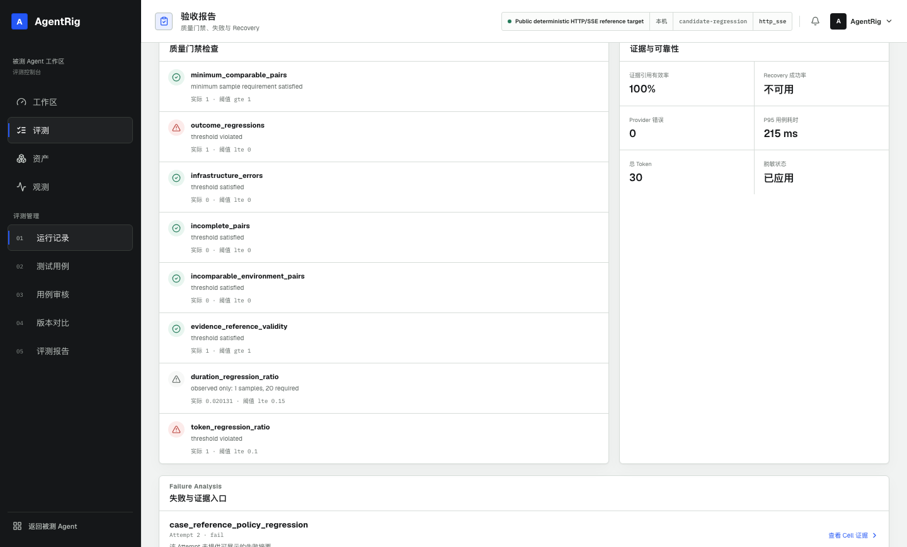
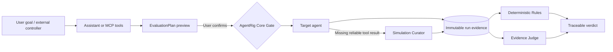

<h1 align="center">AgentRig</h1>

<p align="center"><strong>Make every AI-agent change reproducible, auditable, and regression-tested.</strong></p>

<p align="center">
  MCP-native agent regression evaluation infrastructure for controlled release gates
</p>

<p align="center">
  <a href="https://github.com/ChenCJ-io/agentrig/actions/workflows/ci.yml"></a>
  
  
  
  <a href="./LICENSE"></a>
</p>

<p align="center">
  <a href="#reproduce-it-in-five-minutes">Five-minute demo</a> ·
  <a href="#how-it-works">How it works</a> ·
  <a href="#bring-your-own-agent">Bring your own agent</a> ·
  <a href="./docs/README.md">Documentation</a> ·
  <a href="./README.md">中文</a>
</p>

<p align="center">
  
</p>

<p align="center"><sub>A real local run: the A/B acceptance report and release gate, every verdict backed by immutable run evidence.</sub></p>

Agent regressions rarely come from an unreachable endpoint. They appear when a model, prompt, tool, context,
or dependency changes and the agent no longer satisfies a business or safety constraint. AgentRig turns an
evaluation goal into a **previewable, explicitly confirmed, idempotently submitted** plan, then preserves the
evidence chain from tool calls to the final verdict. No component can overwrite execution history with a
plausible chat message or bypass confirmation, permission, and evidence gates.

## Why AgentRig

| Common failure | AgentRig's answer |
|---|---|
| A response looks right, but its path cannot be inspected | Immutable run snapshots, RunEvents, tool results, evaluations, and evidence references |
| Tool behavior is difficult to reproduce | A controlled Fixture → Sample → Simulation Curator → Real Tool provider chain |
| “Execution completed” is treated as “test passed” | Separate run status, deterministic Rules, Evidence Judge, and external-controller records; `completed ≠ pass` |
| A single success hides model variance | Cells and independent Attempts expose the real distribution of repeated runs |
| Model or runtime failures erase context | Database-backed facts, idempotent retries, reconnect recovery, and explicit failure projection |
| Evaluation entry points receive excessive authority | The web assistant, MCP controllers, and the execution core use separate permission surfaces and confirmation boundaries |

## How it works



| Role | Owns | Explicitly does not own |
|---|---|---|
| **Assistant / external controller** | Understanding goals, querying assets, drafting plans, explaining results | Bypassing confirmation or writing verdict facts |
| **Simulation Curator** | Generating validated, controlled tool results when samples are missing | Calling real business tools or deciding pass/fail |
| **Evidence Judge** | Ruling independently on frozen evidence with citations | Editing RunEvents or inventing evidence |
| **AgentRig Core** | Execution, permissions, state machines, evidence, Rules, audit facts | Depending on model text for correctness |

## Verified scenarios

| Scenario | Expectation | Verifiable evidence |
|---|---|---|
| **Successful regression** | Controlled tool call completes, Rules pass | Tool events, provider hits, and rule references |
| **Policy regression** | Candidate executes before confirmation and is explicitly failed | A/B diff, gate rejection, and the same violation event |
| **Explicit recovery** | The first 503/timeout stays failed; a new run recovers | Two immutable runs, error classification, untouched history |

All three scenarios ship with the [Public Reference Target](./examples/reference_target/README.md) and
reproduce in CI and locally without model keys or private dependencies.

## Reproduce it in five minutes

### Path A: the public deterministic demo (recommended)

Requires only Python 3.12+, [uv](https://docs.astral.sh/uv/), and Node.js 20+. Scenario execution needs no
model key and no Docker.

```bash
git clone https://github.com/ChenCJ-io/agentrig.git
cd agentrig
scripts/reference_demo.sh all --profile reference-ci
```

The script installs locked dependencies, builds the web client, migrates the database, starts both
services, executes the three scenarios, exports evidence, and verifies it offline. Then open
`http://127.0.0.1:8020`; artifacts live in `.agentrig/reference-demo/evidence/`.

```bash
scripts/reference_demo.sh validate-evidence --require-clean-source
scripts/reference_demo.sh down
```

### Path B: the minimal local service

```bash
uv sync --extra dev
cd web && npm ci && npm run build && cd ..
uv run agentrig db upgrade
uv run agentrig serve
```

Default entry points: web `http://127.0.0.1:8000/`, HTTP API `/api/`, streamable HTTP MCP `/mcp/`.
Configuration, authentication, and network boundaries are covered in the
[English quick start](./docs/quickstart.en.md).

### Path C: install the release package

No clone and no frontend build required:

```bash
pip install https://github.com/ChenCJ-io/agentrig/releases/download/v0.4.0a0/agentrig-0.4.0a0-py3-none-any.whl
agentrig db upgrade
agentrig serve
```

Once AgentRig is published to PyPI, `pip install agentrig` is enough.

## Bring your own agent

Create a Target pointing at your agent, pick the matching driver, and let an ExecutionProfile decide how
tools are controlled:

| Driver | Protocol |
|---|---|
| `python_agent` | Python agents built with Agno, LangGraph, or plain functions: no code changes, tools are taken over inside the framework (see the [Python agent guide](./docs/05-Python-Agent接入指南.md), Chinese) |
| `acp` | stdio Agent Client Protocol (Goose and similar coding agents) |
| `http_sse` | Generic externally executed tool-calling SSE protocol |
| `ag_ui` | AG-UI protocol (AgentScope 2.x and others) |
| `agentscope` | AgentScope native runtime |
| `openai_compatible` | OpenAI Chat Completions tool calling |
| `python` / `subprocess` | Custom drivers on the deployment allowlist |

Field references and probe semantics live in the [implementation guide](./docs/01-核心Agent价值复核与讨论交接.md).
Coding agents such as Codex or Claude Code can drive evaluations over MCP using the
[skill catalog](./skills/README.md).

## Capabilities

| Area | Capability |
|---|---|
| **Orchestration** | Single, batch, multi-version, repeated, two-target A/B runs, plan preview and confirmation |
| **Tool control** | controlled, per-CaseRun MCP proxy, observe-only; Fixture/Sample/Curator/Real Tool chain; in-framework takeover for Agno/LangGraph |
| **Evaluation** | Deterministic Rules, Evidence Judge, and external-controller records archived separately |
| **Evidence & recovery** | Immutable snapshots, append-only RunEvents, result references, idempotent state machines |
| **Quality gates** | QualityReport, A/B ComparisonReport, versioned ReleaseGate with stable source hashes |
| **Production ingest** | Two lanes — out-of-band OTel export (OTLP protobuf/JSON) and an OpenAI-compatible gateway — with an onboarding wizard and per-source token, rate limit, and retention |
| **Production regression** | Dual redaction with three body-retention tiers, Trace→Case approval, captured tool calls auto-drafted as Samples, annotation and judge alignment |
| **Engineering & security** | SQLite/PostgreSQL, Alembic, secret references, egress policy, redaction, SBOM, checksums |
| **Interfaces** | React admin UI, evaluation assistant, HTTP API, MCP, CLI, JSON/Markdown/HTML reports |

## Documentation map

| Goal | Start here |
|---|---|
| Run the first reproducible scenario | [English quick start](./docs/quickstart.en.md) |
| Understand boundaries and data flow | [Architecture overview](./docs/00-总体架构.md) |
| Integrate a new target agent | [Implementation guide](./docs/01-核心Agent价值复核与讨论交接.md) |
| Stream live traffic in for regression | [Trace onboarding guide](./docs/04-Trace接入指南.md) |
| Orchestrate MCP workflows | [Skill catalog](./skills/README.md) |
| Browse all authoritative docs | [Documentation hub](./docs/README.md) |

## Quality gates

Main-branch CI covers Python 3.12/3.13, PostgreSQL migrations, the public reference scenarios, isolated
wheel installs, frontend unit tests, browser and accessibility tests, dependency audits, and production
builds.

```bash
uv run ruff check src tests scripts examples
uv run mypy src/agentrig
uv run pytest
cd web && npm run typecheck && npm run test:coverage && npm run e2e && npm run build
```

## Version and maturity

The current version is `0.4.0a0`, an **alpha**. The public reference CI, evidence export, and security
boundaries are implemented and locally verified. AgentRig currently fits reproducible evaluation and
controlled pilots; it is not yet a general-availability release for unattended production. Production
pilots should keep plan confirmation, human approval, least privilege, and audit gates in place.

## Contributing

Before filing issues or changes, read the [support guide](./SUPPORT.md), the
[contributing guide](./CONTRIBUTING.md), and the [security policy](./SECURITY.md). Report vulnerabilities
through GitHub Private Vulnerability Reporting instead of public issues.

AgentRig is released under the [MIT License](./LICENSE).
