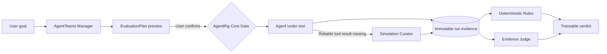

<h1 align="center">AgentRig</h1>

<p align="center"><strong>Make every AI-agent change reproducible, auditable, and regression-tested.</strong></p>

<p align="center">
  MCP-native multi-agent evaluation infrastructure for controlled release gates
</p>

<p align="center">
  <a href="https://github.com/ChenCJ-io/agentrig/actions/workflows/ci.yml"></a>
  
  
  
  <a href="./LICENSE"></a>
</p>

<p align="center">
  <a href="#reproduce-it-in-five-minutes">Five-minute demo</a> ·
  <a href="#how-it-works">How it works</a> ·
  <a href="./docs/README.md">Documentation</a> ·
  <a href="./docs/competition/README.md">GOAI 2026 entry</a> ·
  <a href="./README.md">中文</a>
</p>

<p align="center">
  
</p>

<p align="center"><sub>A real local acceptance run: Manager orchestrates the plan, Curator supplies a controlled tool result, and Judge rules on frozen evidence.</sub></p>

Agent regressions rarely come from an unreachable endpoint. They appear when a model, prompt, tool, context,
or dependency changes and the agent no longer satisfies a business or safety constraint. AgentRig turns a
natural-language evaluation goal into a **previewable, explicitly confirmed, idempotently submitted** plan,
then preserves the evidence chain from tool calls to the final verdict.

It deliberately separates two authorities: **AgentTeams owns collaboration; AgentRig Core owns the facts.**
No agent can overwrite execution history with a plausible chat message or bypass confirmation, permission,
and evidence gates.

> AgentRig is a [GOAI 2026 Agent Infra](./docs/competition/README.md) entry. This repository includes three
> Agent Identities, eleven Skills, real-run evidence, demo scripts, and reproducibly built submission material.

## Why AgentRig

| Common failure | AgentRig's answer |
|---|---|
| A response looks right, but its path cannot be inspected | Immutable run snapshots, RunEvents, tool results, evaluations, and evidence references |
| Multi-agent chat is visible, but actual delegation is not | Matrix request/response event IDs, role invocations, I/O hashes, and terminal states |
| Tool behavior is difficult to reproduce | A controlled Fixture → Sample → Simulation Curator → Real Tool provider chain |
| “Execution completed” is treated as “test passed” | Separate run status, deterministic Rules, Evidence Judge, and external-controller records; `completed ≠ pass` |
| Model or collaboration failures erase context | Database-backed facts, idempotent retries, reconnect recovery, and explicit failure projection |
| Agents receive excessive authority | Role-isolated MCP surfaces and credentials for Manager, Curator, and Judge |

## How it works



| Role | Owns | Explicitly cannot |
|---|---|---|
| **Manager** | Understand goals, query assets, propose plans, explain results | Bypass confirmation or write evaluation facts directly |
| **Simulation Curator** | Generate and validate controlled tool results when trusted samples miss | Call real business tools or decide the final verdict |
| **Evidence Judge** | Rule independently from a rubric and frozen evidence, citing events | Modify RunEvents or fabricate missing evidence |
| **AgentRig Core** | Execution, permissions, state machines, evidence, Rules, and audit facts | Depend on a model or chat text to remain correct |

## Verified scenarios

| Scenario | Expected result | Inspectable proof |
|---|---|---|
| **Successful regression** | Controlled tool flow completes, Rules 3/3, Judge `pass` | Tool events, Curator/Judge invocations, bidirectional Matrix event IDs |
| **Policy regression** | Candidate acts before confirmation and clearly `fail`s | A/B difference, Rules 2/3, Judge cites the same violating event |
| **Explicit recovery** | The first 503/timeout stays failed; a new Run recovers | Two immutable Runs, classified errors, and untouched historical evidence |

See the [real AgentTeams evidence report](./docs/competition/07-真实运行证据报告.md), or use the
[Public Reference Target](./examples/reference_target/README.md) for a deterministic reproduction without
model credentials or private dependencies.

## Reproduce it in five minutes

### Path A: deterministic public demo (recommended)

Requires Python 3.12+, [uv](https://docs.astral.sh/uv/), and Node.js 20+. Scenario execution needs no model
key, Docker daemon, or private project.

```bash
git clone https://github.com/ChenCJ-io/agentrig.git
cd agentrig
scripts/reference_demo.sh all --profile reference-ci
```

The command installs locked dependencies, builds the Web UI, migrates the database, starts both services,
runs three scenarios, exports evidence, and validates the package offline. Open `http://127.0.0.1:8020`;
artifacts are under `.agentrig/reference-demo/evidence/`.

```bash
scripts/reference_demo.sh validate-evidence --require-clean-source
scripts/reference_demo.sh down
```

### Path B: minimal local server

```bash
uv sync --extra dev
cd web && npm ci && npm run build && cd ..
uv run agentrig db upgrade
uv run agentrig serve
```

Defaults: Web `http://127.0.0.1:8000/`, HTTP API `/api/`, and Streamable HTTP MCP `/mcp/`. See
[quick start and secure deployment](./docs/quickstart.en.md) for configuration, authentication,
and network boundaries.

### Path C: complete three-agent acceptance

The live AgentTeams v1.1.2, Matrix, lassist/Pixcake, and model path requires Docker and deployment-provided
credentials. Follow the [local demo and acceptance guide](./docs/04-本机演示与验收.md); secrets belong
only in ignored local environment files.

## Capabilities

| Area | Capabilities |
|---|---|
| **Evaluation orchestration** | Single, batch, multi-version, repeated, two-target A/B runs, plan preview and confirmation |
| **Agent adapters** | ACP, HTTP/SSE, Pixcake, OpenAI-compatible, allowlisted Python/JSONL drivers |
| **Tool control** | Controlled, CaseRun-scoped MCP proxy, observe-only; Fixture/Sample/Curator/Real Tool chain |
| **Evaluation** | Layered deterministic Rule, Evidence Judge, and External Controller records |
| **Multi-agent collaboration** | Manager/Curator/Judge, Matrix Bridge, isolated MCP permissions, eleven Skills |
| **Evidence and recovery** | Immutable snapshots, append-only RunEvents, references, idempotent state machines, reconnect recovery |
| **Engineering and safety** | SQLite/PostgreSQL, Alembic, secret references, egress policy, redaction, SBOM, checksums |
| **Surfaces** | React console, HTTP API, MCP, CLI, and JSON/Markdown/HTML reports |

## Documentation map

| Goal | Start here |
|---|---|
| Run the first reproducible scenario | [Quick start and secure deployment](./docs/quickstart.en.md) |
| Understand boundaries and data flow | [Architecture](./docs/00-总体架构.md) |
| Integrate a new agent under test | [V1 implementation and integration](./docs/01-核心Agent价值复核与讨论交接.md) |
| Deploy three-agent collaboration | [AgentTeams packages](./deploy/agentteams/README.md) |
| Orchestrate MCP workflows | [Skill catalog](./skills/README.md) |
| Inspect competition evidence | [GOAI 2026 delivery center](./docs/competition/README.md) |
| Browse authoritative documentation | [Documentation center](./docs/README.md) |

## Quality gates

Main-branch CI covers Python 3.12/3.13, PostgreSQL migrations, the public reference scenarios, isolated wheel
installation, frontend unit/browser/accessibility tests, dependency audits, and production builds.

```bash
uv run ruff check src tests scripts examples
uv run mypy src/agentrig
uv run pytest
cd web && npm run typecheck && npm run test:coverage && npm run e2e && npm run build
```

## Version and maturity

The current version is `0.2.0a0`, a **GOAI 2026 competition preview / Alpha**. The V2 three-role loop,
public Reference CI, evidence export, and safety boundaries are implemented and locally accepted. It is
appropriate for reproducible evaluation, competition demos, and controlled pilots, but is not yet a general
availability release for unattended production. Production pilots should retain plan confirmation, human
approval, least privilege, and audit gates.

## Contributing

Read the [support guide](./SUPPORT.md), [contribution guide](./CONTRIBUTING.md), and
[security policy](./SECURITY.md) before opening an issue or pull request. Report vulnerabilities through
GitHub Private Vulnerability Reporting, never a public issue.

AgentRig is available under the [MIT License](./LICENSE).
