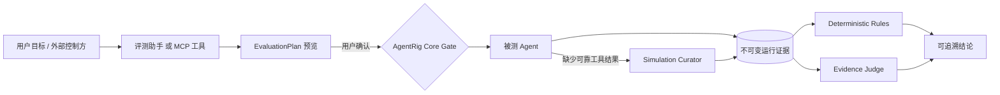

<h1 align="center">AgentRig</h1>

<p align="center"><strong>让每一次 AI Agent 变更都经过可复现、可审计、可回归的验证。</strong></p>

<p align="center">
  MCP 原生的 Agent 回归评测与受控发布门禁基础设施
</p>

<p align="center">
  <a href="https://github.com/ChenCJ-io/agentrig/actions/workflows/ci.yml"></a>
  
  
  
  <a href="./LICENSE"></a>
</p>

<p align="center">
  <a href="#五分钟复现">五分钟复现</a> ·
  <a href="#工作原理">工作原理</a> ·
  <a href="#接入自己的-agent">接入自己的 Agent</a> ·
  <a href="./docs/README.md">文档中心</a> ·
  <a href="./README.en.md">English</a>
</p>

<p align="center">
  
</p>

<p align="center"><sub>真实本机运行界面：A/B 回归的验收报告与质量门禁，全部结论都引用不可变运行证据。</sub></p>

Agent 上线后的风险通常不来自“接口能否调用”，而来自模型、提示词、工具、上下文和依赖变化后，
行为是否仍然满足业务与安全约束。AgentRig 将评测目标转换为**可预览、必须确认、幂等提交**的
执行计划，并保存从工具调用到最终裁决的完整证据链。任何组件都不能通过一段看似成功的文本改写
运行事实，也不能绕过确认、权限或证据门禁。

## 为什么是 AgentRig

| 常见问题 | AgentRig 的处理方式 |
|---|---|
| 回答看起来正确，但过程无法复核 | 保存不可变运行快照、RunEvent、工具结果、评判记录与引用 |
| 工具调用难以稳定复现 | 按 Fixture → Sample → Simulation Curator → Real Tool 的受控 Provider 链执行 |
| “执行完成”被误当成“测试通过” | 分离运行状态、Rule、Evidence Judge 与外部控制方结论；`completed ≠ pass` |
| 单次成功掩盖模型方差 | Cell 与独立 Attempt 暴露重复执行的真实分布 |
| 模型或运行时故障后记录丢失 | 以数据库事实链为准，支持幂等重试、断线恢复和显式失败投影 |
| 评测入口权限过大 | Web 助手、MCP 控制方与执行内核使用分离的权限面和确认边界 |

## 工作原理



| 角色 | 负责 | 明确不负责 |
|---|---|---|
| **评测助手 / 外部控制方** | 理解目标、查询资产、形成计划、解释结果 | 绕过用户确认、直接写入评判事实 |
| **Simulation Curator** | 在可靠样本缺失时生成并校验受控工具结果 | 调用真实业务工具、决定最终 pass/fail |
| **Evidence Judge** | 依据 rubric 和冻结证据独立裁决并引用事件 | 修改 RunEvent、补造不存在的证据 |
| **AgentRig Core** | 执行、权限、状态机、证据、Rule 与审计事实 | 依赖模型或聊天文本才能保持正确性 |

## 已验证的场景

| 场景 | 预期 | 可核验证据 |
|---|---|---|
| **成功回归** | 受控工具调用完成，Rule 通过 | 工具事件、Provider 命中与规则引用 |
| **策略回归** | Candidate 未先确认即执行，明确判 `fail` | A/B 差异、门禁阻断与同一违规事件引用 |
| **显式恢复** | 第一次 503/超时保持失败；新 Run 恢复通过 | 两个不可变 Run、错误分类、未覆盖的历史证据 |

三个场景由 [Public Reference Target](./examples/reference_target/README.md) 提供，无需模型
Key 或私有依赖即可在 CI 与本机完整复现。

## 五分钟复现

### 路径 A：公开确定性 Demo（推荐）

只需 Python 3.12+、[uv](https://docs.astral.sh/uv/) 和 Node.js 20+；场景运行不需要模型 Key
或 Docker。

```bash
git clone https://github.com/ChenCJ-io/agentrig.git
cd agentrig
scripts/reference_demo.sh all --profile reference-ci
```

脚本会从干净环境完成依赖安装、Web 构建、数据库迁移、服务启动、三个场景执行、证据导出及
离线完整性校验。完成后访问 `http://127.0.0.1:8020`，产物位于
`.agentrig/reference-demo/evidence/`。

```bash
scripts/reference_demo.sh validate-evidence --require-clean-source
scripts/reference_demo.sh down
```

### 路径 B：最小本地服务

```bash
uv sync --extra dev
cd web && npm ci && npm run build && cd ..
uv run agentrig db upgrade
uv run agentrig serve
```

默认入口：Web `http://127.0.0.1:8000/`、HTTP API `/api/`、Streamable HTTP MCP `/mcp/`。
配置、鉴权和网络边界见[快速开始与安全部署](./docs/08-快速开始与安全部署.md)。

### 路径 C：直接安装发布包

不需要克隆仓库，也不需要构建前端：

```bash
pip install https://github.com/ChenCJ-io/agentrig/releases/download/v0.4.0a0/agentrig-0.4.0a0-py3-none-any.whl
agentrig db upgrade
agentrig serve
```

发布到 PyPI 后可以直接 `pip install agentrig`。

## 接入自己的 Agent

创建一个 Target 指向你的 Agent，选择匹配的 Driver，再用 ExecutionProfile 决定工具控制方式：

| Driver | 适用协议 |
|---|---|
| `python_agent` | Agno、LangGraph 或普通函数写的 Python Agent：不改代码，工具在框架层被接管（见 [Python Agent 接入指南](./docs/05-Python-Agent接入指南.md)） |
| `acp` | stdio Agent Client Protocol（Goose 等编码 Agent） |
| `http_sse` | 通用外置 tool-calling SSE 协议 |
| `ag_ui` | AG-UI 协议（AgentScope 2.x 等） |
| `agentscope` | AgentScope 原生运行时 |
| `openai_compatible` | OpenAI Chat Completions tool-calling |
| `python` / `subprocess` | 部署 allowlist 内的自定义 Driver |

字段、探针与配置合并规则见 [实现与接入](./docs/01-核心Agent价值复核与讨论交接.md)；
Codex、Claude Code 等编码 Agent 可直接按 [Skill 目录](./skills/README.md) 通过 MCP 控制评测。

## 核心能力

| 领域 | 能力 |
|---|---|
| **评测编排** | 单用例、批量、多版本、重复运行、双 Target A/B、计划预览与确认 |
| **工具控制** | controlled、CaseRun 级 MCP proxy、observe-only；Fixture/Sample/Curator/Real Tool 链；Agno/LangGraph 框架层接管 |
| **评判体系** | Deterministic Rule、Evidence Judge、External Controller 分层存档 |
| **证据与恢复** | 不可变快照、append-only RunEvent、结果引用、幂等状态机、断线恢复 |
| **质量门禁** | QualityReport、A/B ComparisonReport、版本化 ReleaseGate 与稳定来源哈希 |
| **生产接入** | OTel 带外上报（OTLP protobuf/JSON）与 OpenAI 兼容网关双车道、接入向导、接入源级 token/限流/保留期 |
| **生产回归** | 双重脱敏与三档正文策略、Trace→Case 审批、真实工具调用自动生成 Sample 草稿、人工标注与 Judge 对齐 |
| **工程与安全** | SQLite/PostgreSQL、Alembic、Secret 引用、出站策略、脱敏、SBOM 与校验和 |
| **交付界面** | React 管理界面、评测助手、HTTP API、MCP、CLI、JSON/Markdown/HTML 报告 |

## 文档导航

| 想做什么 | 从这里开始 |
|---|---|
| 运行第一个可复现场景 | [快速开始与安全部署](./docs/08-快速开始与安全部署.md) |
| 理解系统边界和数据流 | [总体架构](./docs/00-总体架构.md) |
| 接入新的被测 Agent | [实现与接入](./docs/01-核心Agent价值复核与讨论交接.md) |
| 把线上流量接进来做回归 | [生产 Trace 接入指南](./docs/04-Trace接入指南.md) |
| 了解 Web 评测助手 | [智能评测助手架构](./docs/03-智能评测助手架构.md) |
| 编排 MCP 工作流 | [Skill 目录](./skills/README.md) |
| 查看全部权威文档 | [文档中心](./docs/README.md) |

## 质量门禁

主分支 CI 覆盖 Python 3.12/3.13、PostgreSQL migration、公开参考场景、wheel 隔离安装、前端
单元测试、浏览器与可访问性测试、依赖审计和生产构建。

```bash
uv run ruff check src tests scripts examples
uv run mypy src/agentrig
uv run pytest
cd web && npm run typecheck && npm run test:coverage && npm run e2e && npm run build
```

## 版本与成熟度

当前版本为 `0.4.0a0`，定位为 **Alpha**。公开 Reference CI、证据导出与安全边界均已实现并
完成本机验收；当前适合评测复现和受控试点，尚不是无人值守生产环境的通用 GA 版本。生产试点
应保留计划确认、人工审批、最小权限和审计门禁。

## 参与项目

提交问题或改进前请阅读[支持指南](./SUPPORT.md)、[贡献指南](./CONTRIBUTING.md)和
[安全策略](./SECURITY.md)。安全漏洞请使用 GitHub Private Vulnerability Reporting，不要创建
公开 Issue。

AgentRig 使用 [MIT License](./LICENSE)。
