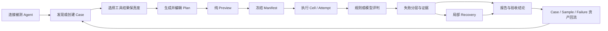

# AgentRig 真实评测闭环与参赛录制优化方案

## 0. 执行结论

本方案基于以下三套真实材料交叉核对后形成：

- `agentrig` 当前代码、数据库模型、MCP、Web、执行器与测试；
- `ts-agent-scope` 当前执行链路、MCP、React 工作台及其中原始 AgentRig 开源规划；
- `lassist-v1-develop` 的项目 Skill、真实评测用例和 Prompt 回归治理记录。

结论不是“让 AgentRig 再接一个 AgentScope 后端”，也不是继续增加外围治理页面，而是：

> **AgentRig 本来就应是 AgentScope 经通用化、脱敏和产品重构后的开源版本。下一阶段要把
> AgentScope 已在真实业务中跑通的评测闭环抽进 AgentRig，让 AgentRig 自己独立完成闭环。**

这里追求的是闭环语义一致，不是所有私有页面、业务字段和模型能力一比一复制。完成后的 AgentRig
必须能够独立做到：

1. 连接任意被测业务 Agent；
2. 从人工描述、历史证据或项目 Skill 中发现、创建并复用测试用例；
3. 用 Fixture、审核样本或受控模拟结果代替昂贵、有副作用的真实工具调用；
4. 在执行前展示并冻结精确矩阵，防止“预览一套、实际跑另一套”；
5. 每次重复运行使用独立 Session，形成可审计的 Cell/Attempt 证据；
6. 区分行为失败、用例问题、评判器问题与基础设施问题；
7. 从冻结快照局部恢复失败组合，保留原始证据；
8. 将真实问题继续沉淀为 Case、Sample 和回归资产，形成用例增长飞轮。

参赛前的主线应从“AgentTeams 协作治理”调整为“真实业务 Agent 的低成本工具层回归”。AgentTeams
可以保留为高级可选能力，但不应是普通用户使用智能评测助手的前置依赖。

## 1. 两个项目的正确关系

### 1.1 产品谱系

`ts-agent-scope/agentrig/01-定位与命名.md` 已经明确了最初定义：

- 被测对象是业务/垂直 Agent；
- Codex、Claude Code 等编码工具是测试驱动者；
- AgentRig 是用例、受控工具结果、执行、评判和证据平台；
- 核心飞轮是“每次改动增长用例，每次发布运行全量”；
- 技术差异化是 MCP Proxy 上的工具层 mock、trace 和断言。

`ts-agent-scope/docs/rfc/2026-07-28-TS-Agent-Scope-后续优化总纲-四线收敛与开源分叉治理-RFC.md`
进一步定义了开源分叉关系：

```text
AgentRig：通用、可公开、可独立部署的开源核心
AgentScope：AgentRig 通用核心 + Pixcake 私有适配、数据和内部治理能力
lassist：真实被测业务 Agent，也是验证这套闭环的首个业务项目
```

因此，正确的长期依赖方向应该是：

```text
                   ┌──────────────────────────┐
                   │  AgentRig Open Core      │
                   │  通用资产/执行/证据/MCP  │
                   └────────────┬─────────────┘
                                │ 私有扩展
                   ┌────────────▼─────────────┐
                   │  AgentScope Internal     │
                   │  Pixcake Adapter + Data  │
                   └──────────────────────────┘
```

短期两个仓库仍可分别开发，但不能形成以下错误架构：

- AgentRig 运行时依赖内部 AgentScope；
- AgentRig 只保存 AgentScope 运行 ID 和投影；
- 开源用户必须部署 AgentScope 才能获得完整评测能力；
- 两边各维护一套不断漂移的 Manifest、Cell、Attempt 与证据协议。

中期应由 AgentRig 成为通用能力的上游，AgentScope 只保留私有 overlay/adapter。比赛前不必先完成仓库
合并，但新增通用能力必须优先进入 AgentRig，并用兼容性测试约束两边语义。

### 1.2 “和 AgentScope 一样的闭环”具体指什么

这句话不是要求：

- 页面数量相同；
- 数据库字段完全相同；
- AgentRig 内置 lassist 的图片、项目、版本或通道语义；
- 两个模型面对同一问题必须生成相同计划；
- AgentRig 把 AgentScope 当作远程 Evaluation Backend。

它要求 AgentRig 具备相同的关键不变量：

| 闭环阶段 | AgentScope 已验证的行为 | AgentRig 应达到的通用结果 |
|---|---|---|
| 资产发现 | 搜索 Case、按工具反查、读取历史与真实样本 | 任意客户端都能查重、理解覆盖范围和引用来源 |
| 执行预览 | 展开排序后的 Cell、排除项、Repeat 和身份 | 纯 Preview，不创建 Run，返回稳定 Manifest Hash |
| 冻结提交 | `expected_manifest_hash` 不一致即拒绝 | 用户确认的计划与真正执行的计划完全一致 |
| 独立重复 | Repeat 使用独立 Agent Session | 每个 Attempt 可单独解释，不能共享会话污染结果 |
| 工具控制 | 内联、脚本、样本、模拟器分层返回 | 默认不调用真实昂贵/有副作用工具，并标注结果保真度 |
| 运行证据 | 有序 Timeline、工具调用/结果、Todo、判定依据 | 统一、可引用、可分页、可供 Web/MCP 消费的证据契约 |
| 失败归因 | 行为、用例、评判、基础设施分层 | 不把连接错误判成 Agent 失败，也不把假红混入回归率 |
| 局部恢复 | 从冻结 Cell 创建 Recovery Run | 原 Run 不可变，只重跑允许恢复的组合 |
| 资产回流 | 真实 Session、样本和失败持续进入用例库 | 每次真实问题最终能增长回归资产，而不是一次性报告 |

这九项形成闭环，外围的审计、团队协作、告警和耐久任务只是支撑能力。

### 1.3 AgentScope 当前闭环为何更成熟

AgentScope 的成熟点不在于用了更多 Agent，而在于执行语义已经在 lassist 真实问题中反复校准：

- `evaluation-manifest.v1` 精确冻结 Case、工具配置、Prompt、Target、维度与重复次数；
- Preview 返回 `manifest_hash`，Submit 使用 `expected_manifest_hash` 做并发保护；
- 提交后先物化所有待运行 Cell，再异步执行；
- Case、Rubric、Mock、Schema、Prompt、Target 都记录运行时身份；
- `interaction-timeline.v1` 将用户消息、文本、Todo、工具调用和工具结果按顺序统一；
- Run 状态和质量 Verdict 分离，执行完成不等于通过；
- `retry_cells` 只从原运行冻结快照创建新 Recovery Run；
- 默认只允许恢复错误或取消项，行为失败必须显式说明理由并覆盖保护；
- MCP 用渐进式查询避免模型一次读取整个大报告。

lassist 的 `prompt-regression-governance` 又把这些执行原语组合成项目级方法：先定义不变量和 Owner，
再做用例去重、矩阵冻结、校准、正式回归、失败分类、局部恢复和最终验收。这说明真正闭环来自：

```text
通用平台原语 + 项目专属 Skill + 真实业务证据 + 必要的人类确认
```

它不是某一个“智能助手模型”单独完成的。

### 1.4 AgentRig 当前并非空壳

AgentRig 已经实现了很多通用基础：

- Target 与多 Driver 接入、连接检查、直接对话调试；
- TestCase、Turn、Assertion、Rubric、Tag 与审核状态；
- controlled/proxy/observe 三类工具模式；
- Fixture、Sample、Curator、Real Tool Provider Chain；
- Run、CaseRun、RunEvent、Evaluation 和外部 Verdict；
- baseline/candidate A/B、Repeat、Capability Snapshot；
- Rule、Evidence Judge、质量报告、A/B 报告与发布 Gate；
- OTLP 生产证据、Trace→Case 草稿和 Lineage；
- 人工审核、Evaluator 校准、Failure Pattern；
- Lease、Heartbeat、外部副作用 Fence 和 Durable Job；
- Core MCP、Web API、AgentTeams Manager/Curator/Judge 集成；
- `build-test-case`、`run-test-cases`、`harvest-tool-samples` 三个通用核心 Skill。

问题不是“有没有开发”，而是“产品主路径是否围绕真实评测闭环组织”。当前投入较多的生产治理、
AgentTeams 和外围控制台，领先于核心执行契约；而 Preview/Manifest、Cell/Attempt、恢复、MCP 取证和
普通助手的自包含能力仍落后于 AgentScope。这造成了页面看起来很完整，但真实用户不知道该从哪里
开始，也很难证明一次运行为什么可信。

## 2. AgentRig 的产品定位

### 2.1 一句话定义

> **AgentRig 是面向业务 Agent 的开源工具层回归测试台：让开发者或普通用户在不真实执行昂贵、
> 有副作用业务工具的情况下，验证 Agent 会不会选择正确工具、传正确参数、遵守确认策略并正确
> 处理工具结果。**

英文定位可继续使用：

> *The MCP-native regression rig for tool-using agents.*

### 2.2 用户真正购买或采用的价值

用户不是为了得到一个 Run ID，而是为了回答以下问题：

- 我的 Agent 接得通吗，能否稳定开始和继续会话？
- 这次 Prompt、工具描述或代码修改影响了哪些既有行为？
- Agent 在成功、失败、空结果、异步或需确认的工具回执下会怎么决策？
- 它会不会误调用、漏调用、参数错误、顺序错误或绕过安全确认？
- 我能否用真实审核样本回放，而不再次生成图片、视频、支付、发信或写生产数据库？
- 五次重复中是否稳定，每次是否真的是独立会话？
- 失败究竟是 Agent 行为、Case、Evaluator 还是测试基础设施造成的？
- 修复后能否只重跑受影响组合，并保留原失败证据？
- 这个问题是否已经沉淀为下一次发布会自动运行的回归资产？

### 2.3 “不消耗工具资源”的精确定义

AgentRig 节省的是业务工具资源与副作用，而不是声称整个评测零成本：

- 可以避免图片/视频生成、付费搜索、外部 SaaS、邮件、支付、发布、数据库写入等真实操作；
- 被测 Agent 自己的模型推理仍可能消耗 Token；
- 使用 Curator 或 Judge 时，也可能消耗评测模型 Token；
- 完全低成本的配置是“Fixture/审核样本 + Rule Evaluator”；
- 受控回放能证明 Agent 的决策行为，不能证明真实生成图片质量或真实工具 SLA。

所有结果页必须明确显示本次运行的工具保真度和真实调用数量，不能把模拟结果包装成端到端真实
业务成功。

### 2.4 明确非目标

AgentRig 不应被做成：

- 通用项目治理或工单平台；
- 另一个只看最终文本的 LLM Eval UI；
- 以 AgentTeams 为默认前提的多 Agent 展示项目；
- 自动修改业务代码的 Web IDE；
- AgentScope 内部服务的开源遥控器；
- 能替用户证明所有真实业务工具质量的模拟器。

## 3. Codex 与 Web 助手是两个独立入口

### 3.1 不要求生成相同计划

Codex 与 AgentRig Web 助手使用的模型、上下文、Skill 和可访问资源不同。面对同一句目标，它们：

- 可以选择不同 Case；
- 可以建议不同矩阵和重复次数；
- 可以给出不同风险判断；
- 可以形成不同 Plan；
- 最终结论也可能因实际运行范围和评判配置不同而不同。

这是允许且合理的。AgentRig 不应为了“看起来统一”强迫两个模型输出同一个计划。

真正必须统一的是：

- Target、Case、Sample、Profile 等资产契约；
- Preview 与 Manifest 的展开规则；
- Cell/Attempt 执行和工具结果控制语义；
- Evidence、Evaluator、Failure Class 与 Recovery 契约；
- 权限、成本、副作用和确认边界。

确定性从“某个 Plan Revision 被用户选中并冻结”之后开始，而不是从自然语言规划开始。

### 3.2 两条入口各自负责什么

| 能力 | Codex + 项目 Skill + MCP | AgentRig Web 智能助手 |
|---|---|---|
| 主要用户 | 开发者、Prompt/工具维护者 | 测试、产品、运营、普通 Agent 用户 |
| 上下文 | 代码、Diff、Git、项目文档、专属 Skill | AgentRig 中已登记的资产、历史运行和用户描述 |
| 计划能力 | 深度理解改动并生成项目化计划 | 用自然语言查询资产、生成可编辑的常规评测计划 |
| 修改代码 | 用户授权后可执行 | 不执行 |
| 创建 Case 草稿 | 可以，遵循项目 Skill | 可以提出并保存草稿，仍需审核 |
| 运行评测 | 通过原子 MCP 工具 | 通过同一 Application Service |
| 证据分析 | 可结合源码继续诊断 | 基于平台证据解释结果和建议下一步 |
| 适合场景 | Prompt 回归、Bug 修复、跨仓验收 | 日常冒烟、已知用例回归、自然语言验证 |

### 3.3 两条入口如何互操作

互操作不是“独立规划也必须相同”，而是通过显式工件 ID 接手：

- Web 可以打开 Codex 已创建的 `plan_id`、`run_id`、`cell_id` 和 `report_id`；
- Codex 可以通过 MCP 查询 Web 已保存的 Plan，并选择继续、复制或另建；
- 只有在显式继续同一个冻结 Plan 时，两条入口才共享同一 Manifest；
- “复制计划”会产生新 Revision 和新 Hash，不冒充原计划；
- 聊天记录只是交互上下文，不是执行事实的权威来源；
- Run、Evidence 和 Verdict 必须由平台业务层产生，不能由任一助手口头补写。

### 3.4 普通助手的最低行为标准

用户问“你是谁”“有哪些被测 Agent”“最近跑了什么”时，助手应直接查询并回答，不得自动创建计划。
只有用户明确表达评测目标时，才进入：

```text
理解目标 → 查询资产 → 提出可编辑计划 → Preview → 用户确认 → Submit
```

基础助手应是单模型、工具调用式、可替换 Provider 的产品能力，不依赖 Matrix 或 AgentTeams。AgentTeams
仅在用户明确启用多角色模拟/裁决时参与。服务端负责权限、Schema、Manifest 和确认校验，模型不拥有
绕过规则的能力。

## 4. AgentRig 应形成的标准闭环

### 4.1 主流程



这条链路应同时被 Web、REST、MCP 和 CI 调用。它们可以有不同的规划体验，但从 Preview 开始必须
进入同一套 Application Service，不能各自实现一份执行规则。

### 4.2 阶段一：连接与能力探测

用户登记 Target 后，平台需要回答：

- 对话端点是否可达；
- 使用什么 Driver/Transport；
- 会话是否可独立创建和关闭；
- 是否能观察工具调用；
- 是否支持 AgentRig 注入工具结果；
- 可用工具及其输入/输出 Schema 是什么；
- 当前 Target、版本、Prompt、工具配置能否形成稳定身份；
- 只能 `observe`，还是可以 `controlled/proxy`。

当前“对话验证”页面应该保留，但应改名为“连接调试”或“Target 调试”。它解决的是接入和协议诊断，
不是正式评测，也不能因为聊通了就显示“评测通过”。

### 4.3 阶段二：用例发现与资产准备

规划前必须先查重和读取已有资产：

1. 按文本、Tag、工具、Target 能力和历史 Failure 搜索 Case；
2. 读取 Case 当前 Revision、历史 Revision 与最近运行；
3. 检查使用的工具结果来自 Fixture、审核样本、模拟器还是 Real Tool；
4. 检查 Assertion、Rubric、Schema 和目标版本是否兼容；
5. 新场景先保存为 Draft，经人工审核后才进入正式回归套件；
6. 从生产 Trace 生成的 Case/Sample 必须保留来源和脱敏记录。

这正是 lassist 的 `build-test-case`、`mine-cases-from-sessions` 和
`harvest-tool-samples` 已经验证的方法。AgentRig 应提供通用原语，具体的图片、项目、版本与通道规则
继续留在 lassist Skill 中。

### 4.4 阶段三：规划、Preview 与冻结

模型生成的是建议，平台展开的才是事实。一个 Plan 至少包含：

- 评测目标和说明；
- Case 显式列表或 Selector；
- Target/版本以及 baseline/candidate 角色；
- Profile 与工具模式；
- 执行维度和重复次数；
- Evaluator 与必要的覆盖策略；
- 是否允许 Real Tool；
- 创建者、来源入口和可选的项目 Skill 身份。

Preview 必须：

- 只读，不创建 Run、Cell 或 Job；
- 解析 Selector 为精确 Case Revision；
- 展开完整、稳定排序的 Cell；
- 列出跳过、拒绝和不兼容项及原因；
- 冻结 Target、Profile、Case、Rubric、Mock/Sample、Tool Schema、Evaluator 身份；
- 计算规范化 JSON 的 `manifest_hash`；
- 明确总 Cell、每 Cell Attempt 和总 Attempt 数；
- 标出预计发生的真实工具调用和副作用风险。

正式 Submit 必须携带 `expected_manifest_hash`。如果资产在 Preview 后发生变化，返回冲突与新 Preview，
不允许静默按新内容执行。

### 4.5 阶段四：执行与证据

Submit 成功后先物化全部 Cell 和 Attempt 的 `pending` 记录，再交给同步或耐久调度器。这样即使 Worker
中途退出，用户也能看到计划中的所有组合，而不是只看到已经开始的部分。

每个评测 Attempt 必须：

- 创建独立被测 Agent Session；
- 使用冻结的 Case、Target、Profile 和工具结果配置；
- 记录有序事件与稳定序号；
- 将工具调用、Provider 选择、工具结果、Assistant 文本和错误关联到同一 Attempt；
- 将运行状态与质量 Verdict 分开保存；
- 在终态后不可原地改写证据。

### 4.6 阶段五：判定、归因与恢复

评判顺序建议为：

```text
执行完整性 Gate
  → 工具 Schema / 参数硬断言
  → 顺序、必调/禁调、确认策略等规则断言
  → 可选语义 Judge
  → 可选 External Verdict / 人工复核
```

如果证据缺失，结论应是 `inconclusive` 或 `evaluation_error`，不能猜测为 pass/fail。

失败分类至少统一为：

| Failure Class | 含义 | 默认能否局部恢复 |
|---|---|---:|
| `INFRA_ERROR` | 网络、Target 不可达、Worker 中断、租约耗尽 | 是 |
| `CASE_INVALID` | Case、Fixture、Sample、Schema 或版本配置不可执行 | 修复资产后新 Revision 运行 |
| `EVALUATOR_ERROR` | Judge 不可用、证据引用丢失、规则实现异常 | 是，需冻结或更新评判身份 |
| `EVALUATOR_FALSE_RED` | 评判逻辑误报，Agent 行为实际正确 | 修复 Evaluator 后重新评判或运行 |
| `BEHAVIOR_FAIL` | Agent 的可观察行为违反断言或 Rubric | 默认否；显式授权后才重跑 |
| `CANCELLED` | 用户或系统协作式取消 | 是 |

Recovery 必须创建新 Run，并引用原 Run/Cell/Attempt；不得清空失败状态后原地重跑。只有冻结执行快照
完整时才允许恢复，否则 fail closed。

### 4.7 阶段六：资产回流

一次运行结束后不应只留下报告：

- 新发现的真实边界场景进入 Case Draft；
- 有代表性的真实工具结果进入 Sample Draft；
- 重复失败形成可检索 Failure Signature；
- 修复后的 Case 进入回归 Suite；
- 报告关联源码版本、Prompt/工具身份和恢复链；
- 下一次 Codex 或助手规划时能检索到这些历史资产。

这一步是 AgentRig 相比一次性 Eval 工具最重要的产品飞轮。

## 5. 通用领域模型

### 5.1 推荐对象关系

```text
Project / Workspace
├── Target
│   └── TargetRevision / CapabilitySnapshot
├── ToolContract
│   └── ToolContractRevision
├── ToolResultSample
│   └── Provenance
├── TestCase
│   └── CaseRevision
├── ExecutionProfile
│   └── ProfileRevision
└── EvaluationPlan
    └── PlanRevision
        └── EvaluationManifest
            └── Run
                └── Cell
                    ├── EvaluationAttempt 1..N
                    │   ├── InteractionEvent 1..N
                    │   └── Evaluation 1..N
                    └── RecoveryLink 0..N
```

`Report`、`Finding`、`Gate` 和人工 `Review` 都应引用上述不可变事实，而不是保存另一份可漂移的运行
副本。

### 5.2 TestCase 与 Revision

当前 AgentRig 直接更新 `TestCaseORM`，运行时虽会保存 `case_snapshot`，但资产层缺少可直接查询的正式
Revision。目标模型至少需要：

- `case_id`：稳定逻辑身份；
- `revision`：单调递增；
- `content_hash`：规范化内容哈希；
- `review_status` 与审核人；
- `source_type/source_ref`：manual、production_trace、historical_import 等；
- Turn、Assertion、Rubric、Fixture/Sample 引用；
- 支持的 Target 能力或版本约束；
- `supersedes_revision` 和变更说明。

P0 可先在现有表上增加内容 Hash，并把完整快照放入 Manifest；P1 再拆正式 Revision 表。不能为了先做
完整版本管理而阻塞最小闭环。

### 5.3 Plan 与 Manifest 必须分开

`EvaluationPlan` 是可编辑的用户意图，`EvaluationManifest` 是一次 Preview 的规范化展开结果：

| 对象 | 是否可编辑 | 是否由模型产生 | 权威内容 |
|---|---:|---:|---|
| Plan Draft | 是 | 可以 | 目标、选择器、Target、Profile、Repeat 等建议 |
| Plan Revision | 否 | 可由模型建议、平台校验 | 用户确认时的结构化输入 |
| Manifest | 否 | 否，由平台确定性生成 | 精确 Cell、快照身份、跳过项、Hash |
| Run | 否 | 否 | 某个 Manifest 的一次实际提交与执行状态 |

两个入口独立创建 Plan 时可以不同；它们若选择同一 Plan Revision 并提交相同 Hash，才会执行相同
Manifest。

### 5.4 Cell、评测 Attempt 与调度 Attempt

AgentScope 已证明 Cell/Attempt 分层对稳定性分析很重要。AgentRig 当前把每个 Repeat 平铺为一个
`CaseRun`，另外又有 Durable Job 的 `ExecutionAttempt`。这三种概念必须拆清：

- **Cell**：一个固定的 Case Revision × Target Revision × 执行维度组合；
- **Evaluation Attempt**：该 Cell 的一次独立业务测试，会创建独立 Agent Session；
- **Scheduler Attempt**：同一个 Evaluation Attempt 因 Worker/Lease 问题发生的基础设施重试。

推荐兼容迁移：

1. 新增 `evaluation_cells`；
2. 给现有 `case_runs` 增加 `cell_id`，先把 CaseRun 作为 Evaluation Attempt 的物理实现；
3. API/Web/MCP 对外使用 `cell` 和 `attempt` 术语；
4. 现有 `execution_attempts` 继续只表达 Lease/Scheduler 重试；
5. 历史 CaseRun 按除 `repeat_index` 外的冻结身份回填 Cell；无法确定时标记 `legacy_projection`；
6. 后续是否重命名物理表不影响对外协议。

### 5.5 Cell Key 必须通用

AgentScope 的业务维度是 Case × App Version × Channel。AgentRig 不应硬编码这些字段，建议：

```json
{
  "case_revision_id": "caserev_xxx",
  "target_revision_id": "targetrev_xxx",
  "comparison_role": "candidate",
  "dimensions": {
    "version": "10.0.0",
    "channel": "desktop"
  }
}
```

`dimensions` 使用稳定排序的通用字典，由项目 Skill 或 Target Adapter 定义可用维度及兼容规则。lassist
可以继续使用版本/通道，其他项目可以使用模型、租户、地区、语言或 feature flag。

### 5.6 关键不变量

平台必须用自动化测试保护以下不变量：

1. Preview 无数据库写入；
2. 相同冻结输入生成相同 Manifest Hash；
3. Hash 不匹配时 Run 尚未创建；
4. Submit 后所有 Cell/Attempt 先可见再执行；
5. 一个 Evaluation Attempt 对应一个独立 Agent Session；
6. 每个 Event 只属于一个 Attempt，序号在 Attempt 内稳定递增；
7. Run 终态与 Evaluation Verdict 相互独立；
8. Recovery 不修改源运行；
9. Scheduler 重试不能伪装成新的业务重复样本；
10. Real Tool 调用必须留下 Provider、授权、成本/副作用与幂等证据。

## 6. 工具结果控制与资源节省

### 6.1 三类运行模式

| 模式 | 工具调用如何发生 | 能否控制结果 | 适用场景 |
|---|---|---:|---|
| `controlled` | Driver 暴露 tool call，AgentRig 回灌结果 | 是 | lassist 类外置工具协议、测试 SDK |
| `proxy` | Agent 将 MCP 工具源指向 AgentRig Proxy | 是，可选择性转发 | 内置 MCP Client 的通用 Agent |
| `observe` | Agent 自己调用工具，仅通过 Trace 上报 | 否 | 零侵入接入、真实性观测、不能稳定 mock 的 Agent |

核心演示必须使用 `controlled` 或 `proxy`，因为“可控制工具返回”才是 AgentRig 与普通观测平台的差异。

### 6.2 Provider 保真度分级

当前 Provider Chain 应增加对用户可见的保真度等级：

| 等级 | Provider | 数据来源 | 默认策略 | 能证明什么 |
|---:|---|---|---|---|
| F0 | Fixture | Case 内联固定结果 | 默认允许 | 完全确定的分支与参数回归 |
| F1 | Approved Sample | 审核过的真实工具回执 | 默认优先 | 已出现过的真实返回形态下的 Agent 行为 |
| F2 | Curator/Simulator | 模型按 Schema 和指令生成 | 显式启用 | 未覆盖边界的探索，可信度低于真实样本 |
| F3 | Real Tool | 真实 MCP/API/业务服务 | 默认关闭，逐工具授权 | 真实集成与副作用结果 |

`Fixture → Sample → Curator → Real Tool` 不应被理解为一定逐层 fallback 到真实工具。Profile 必须允许：

- 禁止某一等级；
- 某工具找不到 Fixture/Sample 时直接失败；
- 只对明确 allowlist 的工具使用 Real Tool；
- 对 Real Tool 设置超时、幂等键和副作用 Fence；
- 在报告中统计每种 Provider 的调用数。

### 6.3 规划时先判断是否适合模拟

每个场景应在 Preview 中标记：

- `fully_simulatable`：结论完全依赖 Agent 决策和结构化工具交互；
- `partially_simulatable`：决策可测，但最终产物质量仍需真实工具或人工检查；
- `real_tool_required`：核心结论无法通过受控回执证明；
- `observe_only`：当前接入方式无法注入结果。

例如“用户选 1 张图但要求从项目挑 10 张，Agent 是否调用项目级挑图工具并传 `project_id`”属于
`fully_simulatable`；“生成的 10 张精修图是否自然”则只能是 `partially_simulatable` 或
`real_tool_required`。

### 6.4 受控评测可以可靠验证的内容

- 是否调用了正确工具；
- 是否避免调用禁用工具；
- 第一个动作是否正确；
- 参数值、Schema、资源范围和数量是否正确；
- 多工具调用顺序；
- 是否先向用户请求确认；
- 成功、空结果、业务错误、超时提示下的后续决策；
- 多轮状态是否被正确继承或清理；
- 多次独立运行是否稳定。

它不能单独证明：

- 真实工具的可用性、延迟和限流；
- 生成图片、视频或文本的最终业务质量；
- 模拟器没有覆盖的返回形态；
- 生产权限、支付、发布等真实副作用一定成功。

UI、报告和参赛讲解必须主动说明这个边界，反而会提升可信度。

## 7. AgentRig 当前差距：代码事实与优先级

下表比较的是当前实际代码，而不是 README 中的愿景。

| 能力 | AgentRig 当前事实 | 与闭环的差距 | 处理级别 |
|---|---|---|---:|
| Target/Driver | 已有 HTTP/SSE、ACP、AgentScope Runtime 等 Driver 和连通检查 | 基础较强；需补稳定 Target/Capability 身份 | 保留增强 |
| 对话调试 | 可直接连接被测 Agent，并展示工具协议事件 | 入口命名易被误解成评测；缺少调试与正式证据边界 | P1 UI |
| Case | 有 Turn、Assertion、Rubric、Tag、Review Status | 更新仍以可变 Case 为主；缺正式 Revision、Hash、历史查询 | P0/P1 |
| Sample | 有来源类型、工具调用来源 ID、参数匹配和审核状态 | MCP 缺按工具/来源导入、引用和 Provenance 工作流；保真度未显式展示 | P0 |
| 工具控制 | 已有 controlled/proxy/observe 与四类 Provider | Real Tool fallback 风险和 F0-F3 可信度未成为显式产品契约 | P0 |
| Preview | `preview_run_cases` 能解析 Case、Target、Profile 和数量 | 只返回摘要；没有精确 Cell 列表、规范 Manifest 和 Hash Guard | **P0 阻塞** |
| Run 层级 | Run → CaseRun，每个 Repeat 是独立 CaseRun | 缺 Cell 聚合；用户无法区分业务重复和调度重试 | **P0 阻塞** |
| 执行证据 | RunEvent 有 `seq`、`attempt_id` 和多类事件 | 缺公开稳定 Timeline 投影、Segment/关联规则和完整性 Gate | P0 |
| 评判 | Rule、Evidence Judge、External Verdict 已实现 | 缺统一 Failure Class；执行错误、评判错误和行为失败仍分散 | P0 |
| Recovery | Durable Job 有 Lease、Heartbeat、重试和副作用 Fence | 这是调度恢复，不是从冻结 Cell 创建业务 Recovery Run | **P0 阻塞** |
| 报告 | REST 已有 Run、Quality、A/B Comparison、Export | Core MCP 未开放渐进结果、Attempt、Report、A/B、History | P0 |
| Capability Discovery | Target 可探测，内部也有多种能力对象 | MCP 没有平台级 `get_capabilities` 和契约版本发现 | P0 |
| 生产证据 | 已有 OTLP、Trace/Span、Trace→Case Draft、Lineage | 很有价值，但尚未与核心 Case/Sample/MCP 飞轮连成主路径 | P1 |
| 人工审核 | Case Review、Annotation、Gold Label、Evaluator Alignment 已较完整 | 页面权重过高且与日常运行入口割裂 | P1 |
| Failure Pattern | 有 Signal、Pattern、Monitor、Webhook 等治理模型 | 比单次运行失败归因更超前；不应替代 P0 Failure Class | P2/高级 |
| 智能助手 | Session/Event/Plan/Decision 持久化完整 | 消息入口硬依赖 AgentTeams/Matrix；普通问答和常规规划不自包含 | **P0 阻塞** |
| AgentTeams | Manager/Curator/Judge、Matrix Bridge 和 Skill 契约较完整 | 被放在主叙事中，部署成本和交互复杂度超过普通评测所需 | 改为可选 |
| Web | 功能覆盖广，Target 工作区与外围治理页面很多 | 单页过大、主次不清、状态术语泄露，真实闭环难一眼理解 | P0/P1 |
| Core Skill | 已有 build/run/harvest 三件套 | 受当前 MCP 缺口限制，尚不能完整表达 Manifest/Cell/Recovery | P0 对齐 |

### 7.1 最核心的结构错位

当前 AgentRig 同时出现两种“前面很重、后面不足”的情况：

1. **规划治理重于执行冻结**：已有 EvaluationPlan、DecisionRecord、确认和 AgentTeams Manager，但 Plan
   最终依赖的 Run Preview 还没有 Manifest Hash 与精确 Cell。
2. **企业治理重于单次证据闭环**：已有 Failure Pattern、人工队列、耐久任务和审计模型，但用户尚不能
   从一个失败 Cell 稳定查看独立 Attempts 并用冻结快照局部恢复。

所以改进策略不是删除所有高级能力，而是先把底座补齐，再让高级能力消费底座的事实。

### 7.2 已有能力应如何处理

| 现有模块 | 决策 |
|---|---|
| Target、Driver、Proxy、Provider Chain | 作为开源核心保留，是 AgentRig 的技术差异化 |
| RunEvent、Rule/Judge、Quality/A-B Report | 保留并统一到新 Manifest/Cell/Attempt 投影 |
| Durable Job | 保留为可选调度层，不和 Evaluation Attempt 混名 |
| Production Evidence、Review | 保留，P1 接到资产飞轮 |
| Failure Pattern、Gate、Audit | 保留为高级治理，默认导航降级 |
| AgentTeams | 保留插件式集成，不再是基础助手和常规运行的硬依赖 |
| 规则助手 | 不恢复；基础助手使用真实模型 + 结构化工具调用 |
| AgentScope Platform Adapter | 不开发；只做语义兼容测试与一次性资产迁移工具 |

## 8. P0：先补齐可信执行内核

P0 的验收目标是：一个全新安装的 AgentRig 不依赖 AgentScope、Matrix 或 AgentTeams，也能对真实 lassist
Target 完成 Preview、冻结、受控执行、独立重复、取证、归因、恢复和报告。

### 8.1 P0-A：平台能力发现与版本化契约

新增平台级能力对象，例如：

```json
{
  "schema_version": "agentrig-capabilities.v1",
  "service_version": "...",
  "contracts": {
    "rest": "agentrig-rest.v1",
    "mcp": "agentrig-mcp.v1"
  },
  "features": {
    "manifest": "evaluation-manifest.v1",
    "timeline": "interaction-timeline.v1",
    "cell_recovery": true,
    "tool_modes": ["controlled", "proxy", "observe"],
    "provider_fidelity": ["F0", "F1", "F2", "F3"]
  }
}
```

实施位置：

- 新增 `src/agentrig/capabilities/platform.py` 或等价模块；
- REST 提供 `GET /api/v1/capabilities`；
- Core MCP 增加 `get_capabilities`；
- Web 启动时读取能力，不根据版本字符串猜功能；
- Core Skill 首步读取能力，并在缺功能时 fail closed。

### 8.2 P0-B：Canonical Preview 与 Manifest Hash

在 `src/agentrig/runs/schemas.py` 增加稳定契约：

- `EvaluationManifest`；
- `ManifestCell`；
- `ManifestIdentity`；
- `RunPreview.manifest`；
- `RunPreview.manifest_hash`；
- `RunPreview.submittable`；
- `RunCasesRequest.expected_manifest_hash`。

Manifest 至少冻结：

```text
schema/canonical serialization version
精确排序的 Cell
跳过/拒绝项
每 Cell repeat/attempt 数
Case payload/rubric/mock identity
Target/Capability identity
Profile/provider identity
Tool input/output schema identity
Evaluator identity
comparison role
通用 dimensions
真实工具授权与副作用摘要
```

哈希规则：

1. 使用 UTF-8；
2. JSON key 稳定排序；
3. 数组按契约定义排序，不能依赖数据库返回顺序；
4. 时间、随机 ID 和展示文案不得进入 Hash；
5. 使用 `sha256:` 前缀；
6. Preview 和 Submit 必须调用同一个纯函数构建 Manifest；
7. `expected_manifest_hash` 不匹配返回 409，且数据库中不存在半成品 Run。

当前 `EvaluationPlan` 使用 Preview fingerprint 做确认保护，可迁移为 Manifest Hash；旧 fingerprint 暂时
保留兼容读取，但不再作为正式执行身份。

### 8.3 P0-C：Cell 与独立 Evaluation Attempt

数据库与 Repository 改造：

- 新增 `EvaluationCellORM`；
- `CaseRunORM` 增加 `cell_id`、`agent_session_id`、`manifest_hash`；
- 新 Run 先创建 Cell，再为 Repeat 创建 CaseRun；
- `repeat_index` 在 Cell 内从 1 开始且唯一；
- Driver 必须为每个 CaseRun 创建新 Session；
- Cell 聚合状态由 Attempts 投影，不允许 Worker 直接任意写；
- Run 计数以 Cell 与 Attempt 两套口径分别返回；
- A/B 配对以 Cell identity 对齐，不用展示层临时拼接。

建议对外投影：

```text
Run
├── cell_count / completed_cell_count / failed_cell_count
├── attempt_count / completed_attempt_count
└── Cells[]
    ├── identity / dimensions / status / verdict
    └── Attempts[]
        ├── repeat_index / agent_session_id
        └── execution_status / evaluation_state / evidence summary
```

不要删除已有 `case_runs` 和 `execution_attempts` 表。采用增量迁移，避免破坏现有用户数据和耐久调度。

### 8.4 P0-D：稳定 Interaction Timeline

在现有 RunEvent 之上增加只读投影 `interaction-timeline.v1`，首版支持：

- `user_message`；
- `assistant_text`；
- `tool_call`；
- `tool_result`；
- `provider_attempt`；
- `validation`；
- `error`；
- 可选 `todo_snapshot`。

每个 Timeline Item 至少包含：

```text
event_id, attempt_id, seq, segment_id, type, occurred_at,
tool_call_id, payload_redacted, source, evidence_integrity
```

执行器应为 tool call/result 建立强关联。当前 Proxy 构造 `ProviderContext` 时也应补齐 `run_id`、
`cell_id/attempt_id` 和 `tool_call_event_id`，确保 Curator/Sample/Real Tool 的来源都能追到具体调用。

### 8.5 P0-E：运行失败分类与 Recovery Run

新增 `FailureClassification`，由执行器和评判器在明确层级写入，不由 UI 猜测。至少记录：

- `failure_class`；
- `reason_code`；
- `summary`；
- `retryable`；
- `source_event_ids`；
- `classifier` 与版本；
- `recommended_action`。

新增 `retry_cells(source_run_id, selectors, reason, override_behavior_fail=false)`：

1. 源 Run 必须终态；
2. Selector 必须命中源 Run 中的冻结 Cell；
3. 默认只允许 `INFRA_ERROR/EVALUATOR_ERROR/CANCELLED`；
4. `BEHAVIOR_FAIL` 需显式 override 和理由；
5. Case/Target/Profile/Schema 快照缺失即拒绝；
6. 新建 Recovery Run，保存 `recovery_of`、选择器和原因；
7. 原 Run、Cell、Attempt、Event、Evaluation 不变；
8. 报告同时显示原失败和 Recovery 结果，不覆盖历史。

Durable Job 自身的 Lease retry 继续自动处理，但只影响 Scheduler Attempt，不产生新的业务重复样本。

### 8.6 P0-F：工具来源、保真度与安全默认值

对 `ToolResultSample` 和 Provider Attempt 增加/统一：

- `content_hash`；
- `fidelity_level`；
- `source_type/source_ref`；
- `captured_at`、`reviewed_at`、`reviewed_by`；
- `tool_contract_hash`；
- `redaction_policy_hash`；
- `synthetic` 标记；
- `real_side_effect` 与成本摘要。

执行默认值调整为：

- Real Tool 全局默认关闭；
- Profile 没有明确 allowlist 时不允许从 F0/F1/F2 自动落到 F3；
- 找不到受控结果时返回 `CASE_INVALID`，不偷偷真实执行；
- UI 确认页突出真实工具数量、工具名和风险；
- 报告显示 `real_tool_calls=0` 时才可声称“未消耗真实业务工具资源”。

### 8.7 P0-G：补齐 Core MCP 闭环

不需要复制 Manager MCP 的全部治理工具。Core MCP 应先稳定以下原子能力：

#### 能力与发现

- `get_capabilities`
- `list_tags`
- `search_test_cases`
- `list_test_cases`
- `get_test_case`
- `get_case_history`
- `find_cases_by_tool`

#### 用例与样本

- `get_test_case_schema`
- `create_test_case_draft` / `update_test_case_draft`
- `get_tool_result_samples`
- `import_tool_result_sample`
- `attach_production_reference`

#### 执行

- `check_target`
- `preview_run`
- `run_cases`（要求可传 `expected_manifest_hash`）
- `cancel_run`
- `retry_cells`

#### 渐进式结果

- `get_run_status(wait_seconds=...)`
- `get_run_results(detail="summary")`
- `get_run_attempts(cell_id, detail="summary|full")`
- `get_interaction_timeline(attempt_id, ...)`
- `get_run_report`
- `get_comparison_report`
- `get_case_history`
- `submit_external_verdict`

现有 `get_run/list_case_runs/get_case_run/list_case_run_events` 暂时保留，并在返回中增加迁移提示。Web、
Core Skill 和新 MCP 工具必须调用同一个 Service，禁止出现 MCP 独立拼装 Manifest 或 Verdict。

### 8.8 P0 后端完成定义

只有同时满足以下条件，才算后端闭环完成：

- Preview 两次得到同一 Hash，且数据库无新增 Run；
- 修改 Case 后用旧 Hash Submit 返回 409；
- Submit 后能立即看到全部 Cell/Attempt pending；
- Repeat=5 产生 5 个不同 Agent Session；
- Fixture/Sample Profile 下真实工具调用计数为 0；
- 任一 Attempt 可按顺序还原完整工具交互；
- 网络错误归为 `INFRA_ERROR`，规则失败归为 `BEHAVIOR_FAIL`；
- 指定错误 Cell 能从冻结快照创建 Recovery Run；
- MCP 无需读取整份报告即可逐层获取状态、结果、Attempt 和证据；
- AgentScope 服务完全关闭时以上能力仍然可用。

## 9. 智能评测助手重构

### 9.1 当前问题的根因

当前 `src/agentrig/v2_api.py` 在 AgentTeams 未启用时直接拒绝助手消息；消息随后经 Matrix Bridge 发送给
Manager，再由 Manager 使用 MCP 和 Skill 操作平台。这个设计适合展示多角色协作，但对普通用户有四个
直接问题：

1. 用户只是问一个问题，也要经过完整协作链；
2. Manager 的进度、内部推理或英文回复可能泄露到公共聊天；
3. 用户确认消息与前一个异步提交交叉时，会出现“确认对象已经失效”的长篇解释；
4. 基础功能依赖 Matrix、角色账号、外部 Runtime 和多份 Token，开源安装难以开箱即用。

之前删除“规则助手”是正确的。下一步不是恢复硬编码问答，而是建立一个真正的单模型基础助手。

### 9.2 两层架构

```text
Web Conversation UI
        │
        ▼
Assistant Orchestrator
  ├── Model Provider（可替换）
  ├── Read Tools（Target/Case/Run/Report 查询）
  ├── Draft Actions（创建/编辑 Plan 或 Case Draft）
  └── Command Validator（权限、Schema、确认、Hash）
        │
        ▼
AgentRig Application Services

可选高级扩展：AgentTeams Adapter → Manager/Curator/Judge
```

基础助手不自己执行 SQL，不自己拼装运行证据，也不直接写终态。它只能调用稳定的 Application Service
Tool。模型 Provider 可支持 OpenAI-compatible、Anthropic 或用户自托管模型；未配置模型时页面明确
提示配置，不伪装成可用助手。

### 9.3 三类用户意图

助手应通过模型的结构化 Tool Call 表达动作，服务端按动作类型处理：

| 意图 | 示例 | 默认行为 |
|---|---|---|
| 资产问答 | “你是谁”“有哪些 Agent”“这个 Case 测什么” | 查询后直接回答，不创建 Plan |
| 诊断问答 | “刚才为什么失败”“第五次调用了什么工具” | 引用 Run/Cell/Attempt 证据回答 |
| 评测操作 | “验证选一张图时仍能从项目挑十张，跑五次” | 查询资产并生成可编辑 Plan Draft |

以下模糊消息不得自动建计划：

- “你能帮我什么”；
- “你是谁”；
- “现在有哪些用例”；
- “解释这个结果”；
- “看看最近的问题”。

如果信息不够，助手只追问会显著改变范围、成本或风险的字段，例如 Target、是否允许 Real Tool 或要
测试 baseline/candidate。已有默认值和可查询事实不重复追问。

### 9.4 计划确认状态机

确认必须绑定结构化对象，不能靠模型从自然语言猜“确认的是哪一步”：

```text
draft
  → previewed(manifest_hash)
  → awaiting_confirmation
  → submitted(run_id)
  → running
  → terminal
```

要求：

- UI 的“确认并运行”请求直接携带 `plan_revision_id + manifest_hash`；
- 聊天中的“确认”只在当前存在唯一 `awaiting_confirmation` 对象时转换成同一结构化请求；
- 已 submitted 的 Plan 再收到旧确认，返回一条短状态消息，不产生新 DecisionRecord；
- 同一个 `idempotency_key` 只能创建一个 Run；
- 新消息到达时取消未发送的旧草稿回复，不能在同一时间输出多个最终回答；
- 用户点击取消时明确区分“取消草稿”和“取消正在运行的 Run”。

### 9.5 对话输出规范

助手面向用户只输出：

- 一条最终回复；
- 必要的结构化卡片；
- 可核验的资产或证据链接；
- 清晰的下一步选择。

不得展示：

- 内部推理；
- “Let me verify...” 等过程播报；
- Matrix 用户 ID、房间协议和 Agent Invocation 内部状态；
- 未经证据支持的“已经提交/已经运行/已经通过”；
- 为了显得智能而重复用户原话的模板回复。

中文用户默认中文回答；技术 ID、工具名和 Schema 字段保持原文即可。模型语言要求属于 System Prompt，
Bridge/投影层继续只接受带精确 Turn Marker 的最终消息，不能把流式草稿投影成多个气泡。

### 9.6 时间与事件顺序

时区修复应遵守：

- 数据库存储 UTC aware datetime；
- API 返回带时区的 ISO 8601；
- Web 默认按 `Asia/Shanghai` 展示，并可在设置中更换；
- 显示文本使用“中国标准时间”或 `UTC+8`，不要写含糊的“本地时间”；
- 事件排序使用服务端 `seq`，不能只靠展示时间；
- 队列消息同时显示“用户发送时间”和“服务端处理时间”，避免把排队交叉解释成模型异常。

### 9.7 AgentTeams 的新位置

AgentTeams 保留三类可选用途：

- Curator 为 F2 场景生成一次受控结果；
- Evidence Judge 对语义 Rubric 进行独立裁决；
- 复杂评测项目中由 Manager 协调多个 Worker。

但默认路径是：

```text
用户 → 基础助手 → AgentRig Core
```

只有 Profile 或用户明确启用时才是：

```text
用户 → 基础助手/Manager → AgentTeams Worker → AgentRig Core
```

右侧“Manager/Curator/Judge 执行拓扑”不再常驻普通助手页面；启用高级模式后再显示。

## 10. Web 信息架构与页面优化

### 10.1 主导航收敛

默认导航只突出完成一次评测所需的四个入口：

1. **被测 Agent**：登记、连接检查、能力与版本；
2. **用例资产**：Case、工具结果样本、执行配置；
3. **评测运行**：新建、Preview、执行、结果与对比；
4. **智能助手**：自然语言查询、规划和解释证据。

以下现有能力移动到“高级/治理”，不删除后端：

- 生产证据；
- 人工审核与 Evaluator Alignment；
- Failure Patterns；
- Durable Jobs；
- Evaluator Teams / AgentTeams；
- 审计日志；
- Release Gate 与系统设置。

原因不是这些功能没有开发，而是它们不应抢占新用户的第一条任务路径。

### 10.2 被测 Agent 工作区

建议页面结构：

```text
Target Overview
├── 连接状态与 Capability
├── 连接调试（原“对话验证”）
├── 关联用例与最近运行
├── 工具契约与结果来源
└── 高级配置
```

顶栏不要重复显示长 Target 名、环境、版本和协议标签。保留一个 Target Selector，详情放入 Overview；
长名称使用省略和 Tooltip，不能挤压主标题与操作区。

### 10.3 新建评测页

正式评测不应从一个聊天空白页开始，而应有明确的结构化入口：

```text
① 目标与 Target
② Case/Selector
③ 工具结果策略
④ 维度与 Repeat
⑤ Evaluator
⑥ Preview
⑦ 确认并运行
```

助手可以帮用户填写这些字段，但字段本身始终可见、可编辑。Preview 页面必须突出：

- Cell/Attempt 数；
- 选中、跳过、拒绝的 Case；
- Fixture/Sample/Simulator/Real Tool 数量；
- 预计真实副作用；
- Manifest Hash；
- 兼容性错误和缺少的资产。

### 10.4 运行详情页

默认使用三层渐进展示：

```text
Run Summary
  → Cell Matrix
      → Attempt Timeline
```

Run Summary 先回答范围、完成度、通过率、失败分类、资源节省和是否可验收；Cell Matrix 再展示每个组合
的稳定性；Attempt 最后展示具体对话和工具证据。不要把几十条长消息直接铺在主工作区。

Cell 详情至少显示：

- Case/Target/Profile/Schema/Manifest 身份；
- 各 Attempt 的独立 Session ID；
- 用户输入与附件摘要；
- 工具调用名、参数、结果来源和结果摘要；
- Rule/Judge/External Verdict；
- Failure Class 与证据引用；
- Recovery 来源或去向。

### 10.5 助手页布局

助手页只保留：

- 左侧：会话历史，可折叠；
- 中间：用户与助手对话、Plan/Run 卡片；
- 右侧：当前选中 Plan 或 Run 的事实面板，可折叠。

右侧不同时堆叠决策、拓扑、三角色、计划、Worker 调用等所有模块。无当前 Plan 时显示相关资产摘要；
有 Plan 时显示 Preview；运行后切换为 Run 摘要。

### 10.6 已出现界面问题的具体修复

- “新建会话”输入框与按钮使用固定按钮宽度、输入区 `min-width: 0`，窄屏不重叠；
- 右侧“编辑/确认计划/取消”做成统一 Sticky Action Bar，避免边框与浮动卡片挤在一起；
- 长 Markdown 限制正文宽度，代码和 ID 可横向滚动，不撑破消息卡；
- 消息区、会话列表和右栏独立滚动，操作条不随长对话消失；
- 页面只保留一个主滚动容器，避免滚轮落在错误区域；
- 状态统一为“草稿/待确认/已排队/运行中/已完成/已取消/失败”；
- `pending` 不直接暴露给中文用户，且不能把已送达误显示为仍等待；
- 缩短默认展示 ID，点击复制完整值；
- 运行卡片中的业务摘要优先于英文系统文本和内部协议字段；
- 断点至少覆盖 1280、1440、1920 宽度和浏览器 80%/100%/125% 缩放。

### 10.7 前端工程拆分

当前 `web/app/pages/product/product-page.tsx` 体积过大，应按业务路由拆为：

```text
pages/targets/
pages/cases/
pages/runs/
pages/assistant/
pages/assets/
pages/advanced/
components/evidence/
components/manifest/
components/timeline/
```

先抽数据 hooks 和稳定业务组件，再移动路由，避免一次性重写 UI。每个页面必须以真实 API 错误为准，
不得在后端不可用时用 Fixture 填成“成功”。

### 10.8 前端策略修正：直接复用 AgentScope，不再另做一套

独立的可执行迁移计划见 [`12-AgentScope前端迁移方案/README.md`](12-AgentScope前端迁移方案/README.md)，
包含资产边界、ViewModel/Adapter 架构、页面批次、视觉验收与后续同步治理。

可以复用，而且应当把它作为默认路线。AgentScope 原始 RFC 的 S4 已明确推荐：复用内部
`frontend/`，放弃按旧文档再用另一套技术栈重写第三遍。

当前代码也证明两边已经具有同一前端血统：

- 都是 React 19、React Router 8、TanStack Query、Lucide、CSS Modules；
- React、Router、Query、TypeScript、Vite 的主要版本一致；
- `Badge`、`Button`、`Panel`、`StatCard` 等基础组件逐字相同；
- 路由和 App Layout 骨架同构；
- Tokens、全局样式、Shell 的命名和结构高度一致；
- AgentRig 已经沿用 AgentScope 的深色侧栏、顶部上下文栏和密集控制台视觉语言。

AgentRig 目前不如 AgentScope 精致的主要原因不是设计方向不同，而是没有同步 AgentScope 后续的专门
精修投入：

| 对比项 | AgentRig 当前 | AgentScope 当前 |
|---|---:|---:|
| 主要产品页 | `product-page.tsx` 约 5545 行，多个领域集中在一个文件 | Evaluation、Conversation、Assets、Observability 分页实现 |
| 评测页面样式 | `product-page.module.css` 约 1114 行，通用卡片为主 | `evaluation-page.module.css` 约 13719 行，逐页面几何和响应式校准 |
| 评测页面实现 | Run/Case/Report 已有，但信息密度和层级较平 | Overview、Batch、Cell、Report、Wizard、Case/Review 全链路 |
| 视觉基线 | 单一 1440 Playwright 项目，少量 E2E | 1280/1600 双桌面基线，并覆盖 1024、390 等边界 |
| 视觉回归 | 主要在失败时截图 | 有批准路由清单、批量截图、真实数据截图和几何断言 |
| 可访问性 | 已覆盖助手关键页 | 评测、对话、资产和全部批准路由均有 Axe 校验 |
| 数据状态 | 页面各自处理 | 已形成权威错误、Loading、Empty、真实数据/Fixture 边界模式 |

AgentScope 的 `157101d` 精修提交单次就对前端增加了大量页面级实现和约 1 万行评测 CSS，同时补齐
视觉捕获、响应式与可访问性测试。AgentRig 后续却把主要投入转向 V2 Assistant/AgentTeams，因此两边
视觉完成度拉开。

结论：**AgentRig 不应再从自己的通用卡片体系继续堆页面，而应把 AgentScope 已批准的页面组件抽成
AgentRig 通用 UI。**

### 10.9 可复用层级

#### A. 可直接复用

这些代码只需改品牌或少量 Import：

- `components/ui/badge.tsx`；
- `components/ui/button.tsx`；
- `components/ui/panel.tsx`；
- `components/ui/stat-card.tsx`；
- `components/ui/page-header.tsx` 的布局部分；
- `components/content/markdown-content.tsx` 与对应样式；
- Tokens、Focus、Typography、Panel、Table、Empty/Error/Loading 基础样式；
- Playwright 双桌面 Viewport、截图命名和 Axe 测试框架；
- App Shell 的几何结构、折叠与响应式逻辑。

`MarkdownContent` 特别适合直接替换 AgentRig 助手当前页内联的 `ReactMarkdown`，它已经处理：

- 长 Markdown 的换行和横向滚动；
- 表格、代码块、引用和标题层级；
- 外链安全属性；
- 受控 Deep Link；
- Focus 与可访问性样式。

#### B. 抽取展示组件后复用

以下组件的视觉和交互可以复用，但必须先与 AgentScope API/Fixture 类型解耦：

| AgentScope 组件/页面 | AgentRig 对应能力 | 复用方式 |
|---|---|---|
| `EvaluationSummaryBand` | Run Summary | 改接通用 Run ViewModel |
| `BatchRunSummary` | 运行摘要卡 | Batch 改名 Run，状态映射 |
| `BatchDetailTabs` | Run 监控/对比 Tab | 保留交互与布局 |
| `BatchExecutionMonitor` | Cell 执行进度 | 改接 Cell/Attempt 计数 |
| `BatchCellList` | Cell Matrix/List | 使用通用 Dimensions |
| `CellDetailPage` | Attempt Timeline 与判定 | 拆成 Cell Header、Attempt List、Evidence Timeline |
| `ReportPage/ReportTabs` | Run/Quality/A-B Report | 适配 AgentRig 报告契约 |
| `VersionOverviewTable/BatchMatrix` | 通用矩阵 | Version/Channel 改成 Dimensions |
| `WizardChrome` 与三步新建页 | Plan/Preview/Submit | 接 AgentRig Manifest Preview |
| `TestCasesPage` | Case Catalog | 删除 Pixcake Level/Channel 默认值 |
| `CaseEditorPage` | Case Draft/Revision | 接 AgentRig Turn/Assertion/Rubric Schema |
| `CasesReviewPage` | Case Review | 对接 AgentRig Review Status |
| `ConversationPage` 三栏结构 | Target 连接调试 | 保留会话、消息、Composer 布局 |
| `RuntimeTargetControl` | AgentRig Target Selector | 去除内部 Agent Context 与私有授权 |
| Assets Master/Detail | Sample/Profile/Tool Contract | 保留三栏资产工作台结构 |
| Tool Schema Editor | Tool Contract Schema | 删除 Pixcake 工具版本字段 |

#### C. 仅复用设计思想，不复制业务实现

- AgentScope API Client 与 `evaluation-adapters.ts`；
- `mocks/evaluation.ts` 中的 Pixcake Case/版本/通道结构；
- `agent-scope.tsx` 中的内部 Agent 目录、用户和权限上下文；
- 钉钉登录与内部 Bootstrap；
- Prompt/Preference/Evoto 等私有工作区；
- AgentDB、图片、项目、修图相关字段；
- 私有 Logo、人物头像和 Release Gate 背景图；
- 内部 API 路由、Header、URL 和真实 Fixture 数据。

这些部分应由 AgentRig 自己的 Target、Project、Capabilities 和 Auth Context 替代。

### 10.10 为什么不能直接复制整个 EvaluationPage

AgentScope 的 `evaluation-page.tsx` 已超过 7000 行，并同时包含：

- 路由匹配；
- API Query/Mutation；
- AgentScope 数据适配；
- Fixture/Mock 模式；
- Pixcake 版本与通道；
- Draft LocalStorage；
- 页面展示组件。

整文件复制会把私有模型和历史兼容逻辑一起带进 AgentRig，也会制造第二个巨型页面。正确做法是从
AgentScope 抽取展示组件和 CSS 子集，以 ViewModel 作为边界；AgentRig 重新实现薄数据 Adapter。

### 10.11 推荐的 AgentRig 前端结构

```text
web/app/
├── branding/
│   └── product-brand.ts
├── view-models/
│   ├── evaluation.ts
│   ├── conversation.ts
│   └── assets.ts
├── adapters/
│   ├── agentrig-evaluation.ts
│   ├── agentrig-conversation.ts
│   └── agentrig-assets.ts
├── components/
│   ├── content/markdown-content.tsx
│   ├── evaluation/
│   │   ├── run-summary.tsx
│   │   ├── cell-matrix.tsx
│   │   ├── cell-detail.tsx
│   │   ├── attempt-timeline.tsx
│   │   ├── manifest-preview.tsx
│   │   ├── report-view.tsx
│   │   └── run-wizard.tsx
│   ├── conversation/
│   │   ├── session-rail.tsx
│   │   ├── message-list.tsx
│   │   └── composer.tsx
│   └── assets/
│       ├── asset-workbench.tsx
│       ├── case-editor.tsx
│       └── tool-schema-editor.tsx
├── pages/
│   ├── evaluations/
│   ├── targets/
│   ├── assistant/
│   └── assets/
└── styles/
    ├── tokens.css
    ├── global.css
    └── components.css
```

ViewModel 只表达页面需要的通用事实，例如：

```text
EvaluationRunVM
  id, title, status, verdict, manifestHash, progress, counts, targets

EvaluationCellVM
  id, caseIdentity, targetIdentity, dimensions, status, verdict, attemptSummary

EvaluationAttemptVM
  id, repeatIndex, sessionId, executionStatus, verdict, failureClass, timeline

ManifestPreviewVM
  cells, attempts, skipped, rejected, providerFidelity, realToolCalls, sideEffects
```

AgentScope 的展示组件改接这些 ViewModel 后，AgentRig 与 AgentScope 都可以消费；版本、通道、图片等
私有字段通过 `dimensions` 或 Detail Extension 展示，不进入通用组件 Props。

### 10.12 复用实施顺序

#### UI-R0：冻结来源与视觉基线

- 记录抽取来源 Commit，首选当前 `157101d` 之后的稳定前端状态；
- 保存 Overview、Run List、Run Detail、Cell、Wizard、Case、Conversation、Sample 的 1280/1600 截图；
- 建立“可抽取/需通用化/禁止进入开源”的文件清单；
- 对私有文案、图片、URL、Header、用户数据和 Fixture 做扫描；
- 确认内部代码的开源授权归属后再进入公开历史。

#### UI-R1：同步设计底座

- 复用 AgentScope 的基础 Tokens、Typography、Panel、Table 和状态色；
- 抽取 `MarkdownContent`；
- 复用 Shell 几何和响应式规则，换成 AgentRig Branding/Target Context；
- 实现通用 `RuntimeTargetControl`；
- 不复制私有 Logo 和 Release Gate 背景图；需要视觉纹理时使用 AgentRig 自有 CSS/SVG 资产。

这一步不依赖 P0 后端，可立即进行。

#### UI-R2：评测主链路

按以下优先级抽取：

```text
Evaluation Overview
  → Run List / Run Detail
  → Manifest Preview / Create Wizard
  → Cell Matrix
  → Cell Detail / Attempt Timeline
  → Report / A-B Comparison
  → Case Catalog / Review
```

展示组件可以先完成，数据接入需等待 P0 Manifest、Cell/Attempt 和 Timeline 契约稳定。旧 CaseRun 页面只
做兼容入口，不继续追加大规模样式。

#### UI-R3：对话与资产

- Target“连接调试”复用 AgentScope Conversation 三栏结构；
- 智能助手复用 Session Rail、Message List、Markdown、Composer，不复用 Pixcake 对话上下文选项；
- Sample、Profile、Tool Contract 复用 Assets Master/Detail 布局；
- Case Editor 复用编辑器框架，字段由 AgentRig JSON Schema 驱动。

#### UI-R4：视觉回归成为合并门禁

将 AgentScope 的方法迁到 AgentRig：

- `e2e/route-manifest.ts` 维护全部批准主路径；
- 1600×1000 与 1280×1000 为固定桌面基线；
- 1440、1024 和 390 做布局/溢出冒烟；
- 校验主操作在首屏或 Sticky Footer 可见；
- 校验页面和 Body 不产生意外横向滚动；
- 对主内容运行 Axe；
- Fixture 视觉捕获和真实后端捕获分目录保存；
- 后端错误时截图必须显示权威错误态，不能回退成漂亮的演示数据。

### 10.13 预期复用收益

粗略按当前代码结构判断：

| 层 | 可复用程度 | 说明 |
|---|---:|---|
| 技术栈与构建 | 90% 以上 | 依赖和版本几乎一致 |
| UI Primitives/Tokens/Shell | 70%–90% | 已有一部分逐字复用 |
| 评测展示层与 CSS | 60%–75% | 需要拆组件并改 ViewModel |
| Conversation 展示层 | 50%–70% | 删除 Pixcake 上下文后可复用 |
| Assets 展示层 | 40%–60% | Master/Detail 通用，业务页差异较大 |
| API/Context/权限 | 10%–30% | AgentRig 必须使用自己的契约与身份模型 |

这不是按行数机械复制的承诺，但足以说明：相比继续独立打磨 AgentRig 当前页面，选择性抽取可以节省
约一半前端展示工作，并直接获得 AgentScope 已经做过的视觉、响应式与可访问性校准。

长期同步方向仍应是 AgentRig 上游：抽取完成后，通用组件首先落在 AgentRig；AgentScope 再消费这些
组件并叠加私有 Branding/Adapter，不能每隔一段时间从内部仓手工复制一次。

## 11. Skill 生态与 AgentScope 能力抽取

### 11.1 AgentRig Core Skill

AgentRig 已有的三个核心 Skill 方向正确：

- `skills/core/build-test-case`；
- `skills/core/run-test-cases`；
- `skills/core/harvest-tool-samples`。

它们应随 P0 MCP 契约升级：

- 开始时调用 `get_capabilities`；
- 建 Case 前先搜索和读取 History；
- 引用审核 Sample，而不是模型虚构工具结果；
- 正式运行前必须 Preview 并携带 `expected_manifest_hash`；
- Repeat 明确为独立 Evaluation Attempts；
- 先读 Summary，再按失败 Cell 取 Attempts/Timeline；
- 使用统一 Failure Class；
- Recovery 只从冻结 Cell 发起；
- 最终明确结论、证据 ID、限制和未运行范围。

Skill 是“如何使用平台完成测试”的方法论，不应复制平台内部的权限、哈希或状态机逻辑。

### 11.2 lassist 项目 Skill 的位置

`lassist-v1-develop/.codex/skills/prompt-regression-governance` 应继续留在 lassist 仓，因为它包含：

- Prompt 输入治理；
- lassist 特有的版本与通道维度；
- PI/PG 目录和验收输出；
- 图片、项目和具体工具语义；
- 项目内的失效、二签和文档回写规则。

AgentRig 只需保证该 Skill 能通过通用 MCP 完成工作，并记录可选的 Skill 名称、版本/Hash 和来源作为
Provenance。不能把 PI、PG、Pixcake 版本规则硬编码进开源领域模型。

### 11.3 从 AgentScope 抽什么

| 抽入 AgentRig 通用核心 | 留在 AgentScope/Pixcake 私有层 |
|---|---|
| Manifest/Hash Guard 语义 | Pixcake 默认版本、通道和工具代际规则 |
| Cell/独立 Attempt/Recovery | lassist 私有 SSE 字段和业务 Initial State |
| Timeline 与证据引用 | 图片、项目、蒙版、修图偏好等领域结构 |
| Case/Sample Provenance | AgentDB 私有表与生产凭证 |
| MCP 渐进查询协议 | 内部 URL、Token、账号和 Matrix 房间 |
| Tool Proxy 与 Provider 保真度 | 私有 Prompt、生产数据和专属报告指标 |
| Rule/Judge/External Verdict 边界 | 只对 Pixcake 有意义的 Reviewer/运营流程 |
| 通用 React 交互与错误处理模式 | 内部品牌、权限、发布和组织管理 |

### 11.4 如何避免两边再次漂移

比赛前采用“契约抽取 + 兼容测试”，不做运行时调用：

1. 从 AgentScope 选择稳定的 Manifest、Timeline、Recovery 和 Result 投影样例；
2. 清除 Pixcake 数据，保存为 AgentRig conformance fixtures；
3. AgentRig 用自己的实现通过这些不变量测试；
4. AgentScope 若继续独立演进，同样运行一份通用契约测试；
5. 新的通用需求先在 AgentRig 定义契约，再由 AgentScope 私有层适配；
6. 逐步把可共享代码下沉为 AgentRig package，AgentScope 引用该 package；
7. 禁止 AgentRig 引用 `ts-agent-scope` Python 模块、数据库或服务地址。

建议新增测试目录：

```text
tests/conformance/
├── test_manifest_contract.py
├── test_cell_attempt_contract.py
├── test_timeline_contract.py
├── test_recovery_contract.py
├── test_provider_fidelity_contract.py
└── fixtures/
```

最终目标不是维护两个“差不多”的实现，而是让 AgentScope 的通用底座真正来自 AgentRig，私有差异由
Adapter 和 Feature Flag 承担。

## 12. 用真实 lassist 场景完成参赛录制

### 12.1 录制冻结结果（2026-08-13）

最终没有使用尚未稳定迁移的“项目级挑图”作为唯一绿例，而是选用当前 AgentRig 已能原生、稳定重放
的三类 lassist 工具决策，并增加一个故意失败的参数诊断：

| 场景 | Run | Attempt | 结果 |
|---|---|---:|---|
| 背景增强 → `apply_image_prompt` | `run_c677c7d81dfe49158f3795d17af5e1a6` | 3 | 3/3 Pass |
| 修图后跨轮撤销 | `run_d9d228fbcd054ca1a96525194fe014d7` | 3 | 3/3 Pass |
| 查询项目后使用返回 ID 打开 | `run_73888e6da6c348139da0bc70436b932b` | 3 | 3/3 Pass |
| 错误期望 `project_id=999` | `run_5c5730c762614f8a871af0183cf3e501` | 1 | 1/1 Expected Fail |

真实边界：lassist 模型推理、HTTP/SSE、Session、工具选择和参数。受控边界：Pixcake 图片客户端
副作用。前三个场景 9/9 通过；失败场景中真实参数 `430409687` 与冻结错误期望 `999` 被准确归因。

### 12.2 双入口的实际证据

Codex 在 lassist 仓库读取 `prompt-regression-governance`，通过 AgentRig MCP 完成 Target 检查、Schema、
Preview、Manifest 确认、Run 与终态查询，生成
`run_3618a91114c44e6a8d74eb8fffdd4ed6`，1 Cell / 1 Attempt / 1 Pass。

Web 助手使用真实模型 Provider 生成 Draft Plan `plan_60552ccfed2a425482ac6be05d24f8d8`。用户明确
只规划不执行，因此确认前真实工具副作用为 0。两条入口允许独立规划，统一的是资产、确认和证据合同。

### 12.3 最终视频结构（3 分 47 秒）

| 时间 | 画面 | 证明内容 |
|---|---|---|
| 0:00–0:59 | 问题、定位、三层结构 | 真实决策与工具副作用为何要分层 |
| 0:59–1:22 | 双入口 | Codex 与 Web 不强求同一计划 |
| 1:22–1:46 | Web 助手真实 Draft | 自然语言规划，人工确认前不执行 |
| 1:46–2:11 | Codex 真实 CLI 摘录 | 项目 Skill + MCP → Manifest → Run |
| 2:11–2:35.5 | 成功 Cell | HTTP/SSE、工具参数、Rule 与 pass |
| 2:35.5–2:58 | 失败报告 | 行为事实与错误期望的参数级差异 |
| 2:58–3:47 | 套件与台账 | 9/9 + 1/1、201/41/4 与诚实边界 |

成片为 1920×1080、30 fps；每场景固定帧，不含 zoompan、鼠标追踪或防抖猜测；旁白使用
`zh-CN-YunxiNeural`，语速 -4%、音高 -2 Hz，替换旧机械女声；硬字幕与独立 SRT 同时交付。

### 12.4 最终 PPT 结构

最终为 11 页：封面、问题、产品定位、双入口、Web 助手、Codex 实跑、成功证据、失败归因、真实套件、
开源架构、验收与边界。9 页主叙事 + 2 页附录，在保持一页一判断的同时，给评委留下可复核数字与
架构入口。PPTX 与 PDF 均为 16:9；PDF 已按 1920×1080 抽帧视觉检查，无破图和缩小留白。

### 12.5 录制材料索引

- `docs/competition/AgentRig-GOAI-2026-初赛方案.pptx` / `.pdf`；
- `dist/competition/media/AgentRig-GOAI-2026-Demo.mp4` / `.srt` / `.json`；
- `docs/competition/assets/live/`：Web 助手、成功与失败全链截图；
- `.agentrig/competition-live/lassist-recording-suite.json`；
- `.agentrig/competition-live/codex-lassist-evaluation.md`；
- `docs/competition/13-Codex-Skill-MCP真实评测.md`；
- `docs/competition/14-音视频与录制质量规范.md`。

## 13. 实施路线与开发顺序

### 13.1 参赛闭环阶段（P0）

以下工期是基于当前代码基础的粗估，需在第一个数据库迁移切片后复核。

| 里程碑 | 内容 | 主要代码位置 | 粗估 |
|---|---|---|---:|
| M0 | 固化契约、选定 lassist 场景与迁移 Bundle | `docs/`、`tests/conformance`、import schema | 2–3 人日 |
| M1 | Capabilities、Canonical Manifest、Hash Guard | `capabilities/`、`runs/schemas.py`、`planner.py`、`service.py` | 4–5 人日 |
| M2 | Cell 投影、独立 Attempts、Timeline 完整性 | DB migration、`runs/repository.py`、`executor.py` | 5–7 人日 |
| M3 | Failure Class、Recovery Run、渐进结果 API/MCP | `runs/`、`reporting/`、`mcp/tools/` | 4–6 人日 |
| M4 | 基础助手 Provider、结构化动作、确认状态机 | `assistant/`、`v2_api.py`、Web assistant | 5–7 人日 |
| M5 | 抽取 AgentScope 参赛核心 UI、接入通用 ViewModel、完成 lassist 导入与录制验收 | `web/app/`、frontend adapters、importer、E2E | 9–14 人日 |

单人串行约 29–42 人日；后端契约稳定后，前端与助手可并行。比赛前不要同时扩展新的外围治理功能。M5 只迁移 Overview、Plan Preview、Run Monitor、Cell Detail 和 Assistant 五个录制必需界面，其中 Assistant 展示层的 2–3 人日已纳入 M4，不重复计算；Assets、Conversation 与其他完整工作台在 P1 继续收敛。

### 13.2 P0 开发顺序

严格按以下依赖执行：

```text
Capabilities
  → Manifest pure builder + conformance tests
  → DB Cell migration
  → Submit materialization
  → Executor independent sessions + Timeline
  → Failure/Recovery
  → REST/MCP result projection
  → Core Skill update
  → Base Assistant
  → Web core pages
  → lassist live rehearsal
```

不要先重画整套 UI。否则页面会再次领先于后端事实，只能用临时状态和解释性文案填空。

### 13.3 P1：用例增长飞轮

P0 录制闭环稳定后继续：

- 正式 Case Revision 与 History；
- OTLP/其他 SessionSource → 通用 Normalized Trace；
- Trace → Case/Sample 候选去重；
- Sample 形态聚类、审核与污染防护；
- Failure → Case Draft 一键回流；
- Suite、Release Policy 和 CI Gate；
- Prompt/Tool Contract 通用版本身份；
- 从历史运行反查 Case 稳定性和覆盖缺口。

P1 完成后才能真正兑现“每次改动增长用例”。

### 13.4 P2：高级生产治理

最后再增强：

- Failure Pattern 聚类、复发 Monitor 和通知；
- 多人 Review Queue 与 Evaluator Alignment；
- AgentTeams 多角色扩展；
- 大规模 Durable Scheduler 与 Worker 运维；
- 多租户、RBAC、审计查询和 Release Gate；
- 更完整的成本、质量和生产反馈指标。

这些能力已有不少代码，应在消费 P0 统一 Cell/Evidence/Failure 契约后再对外主推。

### 13.5 每个里程碑的提交原则

- 数据库迁移向前兼容，旧 Run 可读；
- 对外 Schema 有版本号；
- REST、MCP、Web 不重复业务逻辑；
- 每个新契约先有单元/契约测试，再改 UI；
- 真实 Target E2E 不用 Public Fixture 代替；
- 错误必须权威失败，不能用前端 fallback 假装成功；
- 每个里程碑更新本文的“实际完成情况”，方案与实现不漂移。

## 14. 最终验收标准

### 14.1 独立开源能力

- [x] 从隔离环境安装 AgentRig，无需 AgentScope 仓库、数据库或服务；
- [x] 无需 Matrix/AgentTeams 即可使用基础智能助手；
- [x] 可连接真实 lassist 或另一通用 Agent Target；
- [x] capability/Schema 工具能声明稳定契约和可用能力。

### 14.2 可信执行

- [x] Preview 不写数据并返回精确 Manifest 与 Hash；
- [x] Submit 使用 `expected_manifest_hash`，漂移时创建 Run 前失败；
- [x] 全部 Cell/Attempt 在执行前物化；
- [x] Repeat=3 对应三个独立 Agent Session；
- [x] 每个 Attempt 能还原有序 Timeline；
- [x] 执行状态与质量 Verdict 分离；
- [x] 失败有统一 Failure Class；
- [x] Recovery 创建新 Run 且不修改旧证据。

### 14.3 工具资源控制

- [x] Fixture、审核 Sample、Simulator、Real Tool 在 UI/报告可区分；
- [x] Real Tool 默认关闭且必须逐工具授权；
- [x] 找不到受控结果时 fail closed；
- [x] lassist 主场景记录 controlled fixture 和真实工具副作用 0；
- [x] 报告明确列出受控评测不能证明的真实业务质量。

### 14.4 双入口

- [x] Codex 可用项目 Skill + Core MCP 独立规划并执行真实 Run；
- [x] Web 助手可用自然语言独立生成 Draft Plan，并经人工确认边界执行；
- [x] 两个入口允许计划不同，不做错误的一致性断言；
- [ ] 任一入口都可按 ID 查看、继续或复制另一入口的工件；
- [ ] 继续同一 Plan 时共享冻结 Manifest，复制时产生新 Revision/Hash；
- [x] 普通问答不自动创建评测计划。

### 14.5 用户体验

- [x] 中文请求不出现内部英文推理或过程播报；
- [x] 事件默认按 Asia/Shanghai 展示，顺序由服务端 seq 保证；
- [x] 页面主路径在三次点击内到达“新建评测”；
- [x] Run→Cell→Attempt 三层可理解；
- [x] 1280/1440/1920 与常用缩放下无重叠和不可见操作；
- [x] AgentTeams、Failure Pattern、Durable Job 等高级模块不干扰默认流程。

### 14.6 参赛证据

- [x] 主演示使用真实 lassist Case、Target 与项目 Skill；
- [x] AgentRig Native Runner 生成自己的 Run/Cell/Attempt/Evidence；
- [x] 视频中能看到 Manifest Hash、重复 Attempt、工具参数和结果来源；
- [x] 历史 AgentScope 证据不冒充 AgentRig 当前运行；
- [x] 演示全过程不依赖硬编码成功结果和临时数据库修改；
- [x] PPT、视频、README 对产品定位和能力边界表述一致。

## 15. 风险与非目标

| 风险 | 应对 |
|---|---|
| 为追求 AgentScope 全量功能导致范围失控 | 只追闭环不变量，Pixcake 私有能力留在 Adapter |
| Cell 迁移破坏历史 CaseRun | 增量加表/字段，历史只读投影，保留旧 API 过渡期 |
| Simulator 结果被误认为真实 | F0-F3 强制展示，报告披露 synthetic 与限制 |
| Real Tool fallback 产生真实副作用 | 默认关闭、allowlist、确认、Fence、审计和 fail closed |
| 助手再次泄露推理或重复回复 | 单最终消息、Turn Marker、服务端动作状态机、投影过滤 |
| 两入口结论不同引发误解 | 展示各自 Plan/Manifest/范围，不承诺自然语言规划一致 |
| 两仓继续漂移 | Conformance suite + AgentRig upstream + AgentScope private overlay |
| 比赛演示依赖历史环境 | AgentRig 自运行；历史证据只作来源，提前多轮冷启动演练 |

本阶段明确不做：

- AgentScope 运行时 Backend Adapter；
- 把全部 Pixcake 业务逻辑迁入 AgentRig；
- 强迫 Codex 与 Web 助手生成相同计划；
- Web 助手自动改业务代码；
- 用模拟回执证明真实媒体质量；
- 为比赛临时制造无法复现的全绿 A/B；
- 重写所有高级治理页面。

## 16. 已确定的产品决策

1. **AgentRig 是 AgentScope 的通用开源核心，不是内部平台的外部控制面。**
2. **目标是闭环语义一致，而不是页面和私有能力全量复制。**
3. **AgentRig 必须能独立执行；AgentScope 最终应消费 AgentRig 核心。**
4. **Codex 与 Web 助手可以生成不同计划。**
5. **只有显式继续同一冻结 Plan，才要求共享 Manifest。**
6. **AgentRig 的核心价值是工具层受控回归和用例积累飞轮。**
7. **默认避免真实昂贵/有副作用工具，Real Tool 必须显式授权。**
8. **Rule Assistant 不恢复；基础助手使用可替换真实模型。**
9. **AgentTeams 是高级可选扩展，不是基础助手依赖。**
10. **参赛主演示使用真实 lassist 场景，由 AgentRig 自己运行。**
11. **优先补 Manifest、Cell/Attempt、Timeline、Failure、Recovery 与 MCP。**
12. **外围治理能力保留，但在核心闭环完成前不继续抢占主路径。**
13. **前端以 AgentScope 已验收界面为上游；抽取通用组件和 ViewModel，不再平行维护一套低保真实现。**

## 17. 事实来源索引

### AgentRig 当前实现

- `src/agentrig/runs/schemas.py`：当前 RunPreview、CaseRun 与 Event 契约；
- `src/agentrig/runs/planner.py`：Case/Target/Profile 展开与 Repeat 规划；
- `src/agentrig/runs/executor.py`：Driver、Provider Chain、事件和评判执行；
- `src/agentrig/runs/service.py`：Preview、提交、查询、取消和外部 Verdict；
- `src/agentrig/infrastructure/database/orm.py`：Run、CaseRun、Event、Job/ExecutionAttempt 等表；
- `src/agentrig/tool_results/`：Fixture/Sample/Curator/Real Tool Provider；
- `src/agentrig/proxy/`：MCP Proxy/Aggregator；
- `src/agentrig/mcp/tools/`：当前 Core MCP 工具；
- `src/agentrig/mcp/v2/manager.py`：当前 Manager MCP 和 Plan/Decision 能力；
- `src/agentrig/v2_api.py`：助手消息对 AgentTeams 的硬依赖；
- `src/agentrig/integrations/agentteams/bridge.py`：Matrix 消息投影与 Turn Marker；
- `src/agentrig/reporting/`：Run、Quality、A/B 与导出报告；
- `src/agentrig/production/`：OTLP、Trace→Case 与 Lineage；
- `src/agentrig/reviews/`、`src/agentrig/failures/`、`src/agentrig/jobs/`：高级治理；
- `web/app/pages/product/product-page.tsx`：当前 Target 工作区与主要页面实现；
- `web/app/pages/v2/assistant-page.tsx`：当前智能助手页面；
- `web/app/components/ui/`：已与 AgentScope 同源的 Button、Badge、Panel、StatCard 等基础组件；
- `web/e2e/`、`web/playwright.config.ts`：当前前端验收覆盖，视觉基线仍不完整；
- `skills/core/`：当前 build/run/harvest 三个通用 Skill。

### AgentScope 成熟语义与原始开源规划

- `ts-agent-scope/agentrig/01-定位与命名.md`：AgentRig 原始定位与用例积累飞轮；
- `ts-agent-scope/agentrig/03-开源改造清单.md`：通用核心与 Pixcake 私有边界；
- `ts-agent-scope/agentrig/06-测试执行模型与协议适配.md`：MCP Proxy 工具层测试；
- `ts-agent-scope/agentrig/08-CC测试Skill包.md`：通用 Core Skill 方法论；
- `ts-agent-scope/docs/reference/架构总览.md`：AgentScope 业务与技术架构；
- `ts-agent-scope/docs/reference/测试执行链路.md`：Cell/Attempt/Recovery/证据语义；
- `ts-agent-scope/docs/reference/MCP工具.md`：渐进式 MCP 工具契约；
- `ts-agent-scope/docs/reference/用例生成管线.md`：生产证据到 Case/Sample；
- `ts-agent-scope/core/evaluation/module.py`：Manifest、Hash Guard、物化与 `retry_cells`；
- `ts-agent-scope/core/case_runner.py`：独立会话与 Interaction Timeline；
- `ts-agent-scope/core/capabilities.py`：平台 Capability Contract；
- `ts-agent-scope/frontend/app/pages/evaluation/`：Overview、Batch、Cell、Report 与评测向导的成熟页面和 Pencil 视觉基线；
- `ts-agent-scope/frontend/app/pages/conversation/`、`ts-agent-scope/frontend/app/pages/assets/`：成熟的对话与资产工作台；
- `ts-agent-scope/frontend/app/components/content/markdown-content.tsx`：可通用化的 Markdown 内容渲染与可访问性处理；
- `ts-agent-scope/frontend/app/components/shell/runtime-target-control.tsx`：可复用的运行目标切换交互；
- `ts-agent-scope/frontend/tests/e2e/route-manifest.ts`、`ts-agent-scope/frontend/tests/e2e/visual-capture.spec.ts`：多尺寸路由和视觉回归验收基线；
- `ts-agent-scope/docs/rfc/2026-07-28-TS-Agent-Scope-后续优化总纲-四线收敛与开源分叉治理-RFC.md`：
  AgentRig/AgentScope 开源分叉关系，其 8.3 节明确推荐复用 AgentScope `frontend/`。

### lassist 真实项目闭环

- `.codex/skills/prompt-regression-governance/SKILL.md`：Prompt 回归治理主流程；
- `.codex/skills/prompt-regression-governance/references/case-execution-policy.md`：Cell 与独立 Attempt；
- `.codex/skills/prompt-regression-governance/references/agentscope-tool-playbook.md`：平台工具调用顺序；
- `.claude/skills/build-test-case/SKILL.md`：查重、真实样本、Schema 与人工审核；
- `.claude/skills/run-test-cases/SKILL.md`：运行选择和失败诊断；
- `.claude/skills/harvest-tool-samples/SKILL.md`：真实回执采集与污染防护；
- `.claude/skills/mine-cases-from-sessions/SKILL.md`：真实 Session 到场景候选；
- `docs/prompt-iterations/programs/PG-202608-initial-model-input-optimization/05-动态用户消息修复/
  PI-20260810-02-images-project-scope/`：本次参赛主场景的真实 PI 证据。

以上 lassist 路径相对于 `/Users/chenchunjie/Desktop/Project/lassist-v1-develop`，AgentScope 路径相对于
`/Users/chenchunjie/Desktop/Project/ts-agent-scope`。
