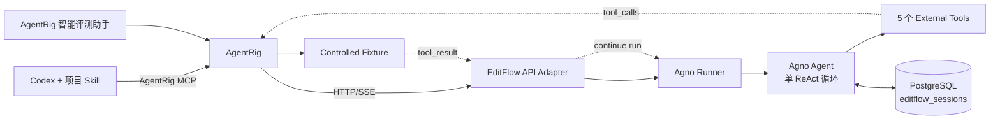

# EditFlow Demo Agent 架构设计

> 状态：Proposed，待评审后实施  
> 更新：2026-08-13（Asia/Shanghai）  
> 定位：基于真实修图工作流重新设计、可公开、可复现的 AgentRig 被测 Agent

## 1. 结论

Demo Agent 改为 **EditFlow Agent**：一个使用 Agno 单 Agent ReAct 循环的修图助手。它保留成熟修图
Agent 的关键形态——图片上下文、自由修图、素材检索/应用、裁剪和多步工具链，但重新命名工具、重写
Prompt、替换 Schema、Fixture、图片和业务标识，不复制私有实现。

首版固定为：

| 决策 | 方案 |
|---|---|
| Agent 框架 | `agno==2.6.11`，单个 `Agent` |
| 模型 | 一个 OpenAI-compatible 模型，由环境变量配置 |
| Prompt | 一个 `prompts/system.md`，启动时加载 |
| 工具 | 图片检查、自由修图、素材搜索、素材应用、裁剪，共 5 个 |
| 工具执行 | 全部使用 Agno external execution，由 AgentRig Fixture 返回结果 |
| 对外协议 | FastAPI + `POST /chat/stream` + SSE |
| 会话 | Agno `AsyncPostgresDb`，仅一张 `editflow_sessions` 表 |
| 运行缓存 | 只保留 session 锁和 pending run 热缓存；无 Redis |
| 版本机制 | 无 Prompt/工具/Profile 版本路由；修改后重启进程 |
| 安全边界 | 不上传图片、不真正修图、无业务 API、无外部工具资源消耗 |

这里的“ReactAgent”按 **ReAct（Reason + Act）Agent** 理解，不是 React 前端。Agno 中直接使用
`Agent` 完成“理解意图 → 选择工具 → 获取结果 → 继续决策/回答”，不增加 Team、Workflow、Planner
或子 Agent。

## 2. 产品场景与核心回归

EditFlow 面向一个已打开的演示相册。AgentRig 在 Case `initial_state` 中注入当前工作区和选中图片：

```json
{
  "workspace": {
    "album_ref": "album-demo-01",
    "selected_image_refs": ["image-demo-portrait-01"],
    "locale": "zh-CN"
  }
}
```

核心录制任务：

> 把照片调亮一点，换成雪山背景，再裁成 4:5，人物不要改变。

初始 Prompt/工具描述存在边界重叠，把复杂请求整体交给自由修图工具。可观察的错误是：

```text
retouch_photo(
  instruction="调亮、换雪山背景、裁成4:5，人物不要改变"
)
```

正确行为应拆成专用工具链，并将每一步返回的新图片引用交给下一步：

```text
inspect_image(image-demo-portrait-01)
  → retouch_photo(..., preserve_subject=true)
    → search_assets(asset_type=background, query=雪山)
      → apply_asset(..., preserve_subject=true)
        → crop_photo(..., ratio=4:5)
```

这个场景比虚构发布流程更适合参赛录制：它来自真实 Agent 的工具路由问题，同时可以用工具名、顺序、
参数和 `output_image_ref` 传递做确定性断言。AgentRig 不需要真的运行修图算法，因此不会消耗图片生成
或渲染资源。

## 3. 范围与非目标

### 3.1 首版包含

- 真实模型意图理解、工具选择和多轮对话；
- 一个经过验证的混合修图工具链；
- 受控工具结果回灌和连续工具调用；
- PostgreSQL Session 持久化；
- 与 AgentRig `http_sse` Driver 对齐的 HTTP/SSE 契约；
- 模型可见输入 SHA、模型、源码和进程启动身份；
- 单元、协议、数据库重启和 AgentRig Live 测试；
- 后续放入 Demo 仓库的脱敏 Prompt 回归 Skill。

### 3.2 明确不做

- 不复制原项目源码、Prompt、工具文案、数据、品牌词、项目 ID 或图片；
- 不做 Redis、RunBuffer、后台任务、断线事件重放；
- 不做长期记忆、用户偏好、向量库、知识库或会话摘要；
- 不做 Prompt、工具或模型的运行时版本注册/选择；
- 不做客户端版本、通道和工具 Profile 矩阵；
- 不支持图片上传、附件解析、蒙版、人脸聚类或真实图像算法；
- 不输出隐藏思维链，只输出最终文本和可审计工具事件；
- 不做独立前端，演示 UI 使用 AgentRig。

## 4. 复用与脱敏原则

复用的是已经证明有效的架构模式，不是源代码搬运：

| 成熟做法 | EditFlow 处理 |
|---|---|
| Markdown Prompt + 启动时加载 | 保留，收敛为一个文件 |
| Agent factory | 保留，用于装配模型、DB、Prompt 和工具 |
| 模型自主工具路由 | 保留，这是评测对象 |
| 图片工作区随请求进入 | 保留，改为通用 `workspace` Schema |
| 图片信息、修图、素材、裁剪工具 | 保留能力类别，全部重命名并重写 Schema/描述 |
| 客户端执行工具并回传结果 | 改用 Agno 原生 external execution |
| PostgreSQL Session | 保留，只有一张 Session 表 |
| Redis、后台恢复、动态工具注册 | 删除 |
| 多版本、多通道、复杂创意链 | 删除 |

公开仓库只能包含从零编写的实现和虚构数据。内部“旧工具到新工具”的名称映射不进入仓库、PPT、日志
或录屏。

## 5. 总体架构



职责边界：

- **EditFlow**：模型、Prompt、工作区上下文、会话历史和工具决策；
- **AgentRig**：Case、Fixture、重复执行、断言、Timeline、比较和验收结论；
- **Codex**：读取项目 Skill、治理用例、修改 Prompt/工具描述并调用 AgentRig MCP；
- **前端助手**：让普通用户用自然语言复用已治理的 Case；
- 两个入口可以生成不同计划，但结论都必须引用对应 Run 的真实证据。

## 6. 建议仓库结构

EditFlow 建议放在与 AgentRig 平级的独立公开仓库：

```text
editflow-demo-agent/
├── AGENTS.md
├── README.md
├── pyproject.toml
├── compose.yaml                    # 仅 PostgreSQL
├── .env.example
├── migrations/
│   └── 001_create_sessions.sql     # 只创建 editflow_sessions
├── src/editflow/
│   ├── main.py
│   ├── settings.py
│   ├── build_identity.py
│   ├── api/
│   │   ├── schemas.py
│   │   ├── sse.py
│   │   └── routes.py
│   ├── agent/
│   │   ├── factory.py
│   │   ├── model.py
│   │   └── runner.py
│   ├── prompts/
│   │   ├── loader.py
│   │   └── system.md
│   ├── tools/
│   │   └── catalog.py
│   └── runtime/
│       ├── database.py
│       └── pending_runs.py
├── tests/
│   ├── unit/
│   ├── contract/
│   └── live/
├── agentrig/
│   ├── seed_assets.py
│   └── fixtures.json
└── .codex/skills/
    └── prompt-regression-governance/
        └── SKILL.md
```

`AGENTS.md` 和 Skill 只描述公开契约，不引用私有仓库路径、内部工具名称或历史用例。

## 7. Agent 设计

### 7.1 Agent factory

每次请求都可以按相同 `session_id` 创建轻量 Agent；会话历史由 DB 恢复，不依赖常驻 Agent 对象：

```text
Agent
├── id: editflow-agent
├── session_id: 当前请求 session_id
├── model: OpenAILike(...)
├── instructions: 启动时冻结的 system.md
├── tools: 5 个 external Function
├── db: AsyncPostgresDb
├── add_history_to_context: true
├── num_history_runs: 8
├── store_history_messages: false
├── enable_agentic_memory: false
├── enable_session_summaries: false
├── telemetry: false
└── markdown: false
```

Agno 的运行循环原生支持模型工具调用；external execution 会暂停当前 Run，应用设置工具结果后使用
`acontinue_run` 继续。接口依据 [Agno Running Agents](https://docs.agno.com/agents/running-agents)、
[Agno Tools](https://docs.agno.com/tools/overview) 和
[External Tool Execution](https://docs.agno.com/hitl/external-execution)。

### 7.2 工作区上下文

首次 `chat` 请求必须带 `initial_state.workspace`。API 先用 Pydantic 校验，再写入
`session_state["workspace"]`，通过 `add_session_state_to_context=True` 提供给模型。

同一 session 的后续请求可以省略 `initial_state`；若再次提供且与已持久化工作区不同，返回
`WORKSPACE_MISMATCH`，不得静默覆盖。这能防止多轮确认或工具结果落到另一张图片。

### 7.3 模型可见输入

模型可见输入只有：

1. `prompts/system.md`；
2. 5 个工具的名称、描述和 JSON Schema；
3. 经过校验的工作区上下文；
4. 当前会话历史和本轮用户输入。

启动时对前两项规范化、排序后计算 `model_input_sha256`。它只是运行身份，不提供热更新或版本路由。
Codex 修改 Prompt/工具描述后必须重启进程，并由 AgentRig 冻结新的 Capability。

## 8. PostgreSQL Session 设计

### 8.1 技术选择

采用与成熟实现相同的 Agno 存储适配方式：

```text
SQLAlchemy AsyncEngine
  └── postgresql+asyncpg://...
        └── Agno AsyncPostgresDb(
              db_schema="public",
              session_table="editflow_sessions",
              create_schema=False
            )
```

`psql` 只用于本地建库/查看，服务运行时使用 `asyncpg`。依赖仅需 `sqlalchemy`、`asyncpg` 和 Agno，
不同时安装多套 PostgreSQL Driver。

### 8.2 为什么严格只有一张表

Agno 自动创建 Session 表时还可能写自身 schema 版本表。为了遵守 Demo 的“单表”边界：

1. `001_create_sessions.sql` 预先创建与 `agno==2.6.11` 匹配的表和索引；
2. `AsyncPostgresDb(create_schema=False)` 只加载并校验现有表；
3. 不调用 `_create_all_tables`；
4. 不配置 memory、metrics、eval、knowledge、trace 或 approval 表；
5. 启动检查确认 `public.editflow_sessions` 存在且 Schema 匹配，否则快速失败。

表字段沿用 Agno Session 契约：

| 字段 | 用途 |
|---|---|
| `session_id` | 主键，AgentRig Attempt 的会话标识 |
| `session_type` | 固定 `agent` |
| `agent_id` | 固定 `editflow-agent` |
| `user_id` | 可空，Demo 默认不启用用户体系 |
| `session_data` | 工作区和 Session state |
| `agent_data` | Agent 元信息 |
| `runs` | 多轮 Run、消息、工具调用及暂停状态 |
| `metadata` | 模型输入 SHA、模型和进程身份 |
| `summary` | 保留兼容字段，首版不启用摘要 |
| `created_at` / `updated_at` | Unix 时间戳 |
| Team/Workflow 兼容字段 | 保留为空，以通过 Agno Schema 校验 |

### 8.3 恢复边界

数据库带来两种能力：

- 进程重启后，同一 `session_id` 的已完成历史可以继续对话；
- Agno 会把 external execution 的 paused Run 写入 Session。若 `tool_result` 到达时热缓存丢失，Runner
  可按 `session_id + tool_call_id` 找到最近的 paused Run，再用 `run_id` 继续。

明确不承诺：

- 不重放已经断开的 SSE 文本；
- 不恢复尚未写入 DB 的半截模型流；
- 不支持多 worker 并发争抢同一 session；Demo 固定 `uvicorn --workers 1`；
- 无法唯一匹配 paused Run 时返回错误，由 AgentRig 重跑独立 Attempt。

内存只保存 `session_id -> asyncio.Lock` 和 paused Run 热缓存，不承载历史真相，也不引入 Redis。

## 9. 工具设计

五个工具均为 Agno `Function(external_execution=True)`，设置严格输入 Schema 和结果 Schema。没有任何
工具 entrypoint 连接真实图像服务。

### 9.1 `inspect_image`

检查图片尺寸和主体信息，用于裁剪及“人物不要改变”等约束判断。

```json
{
  "image_ref": "image-demo-portrait-01",
  "include_dimensions": true,
  "include_subjects": true
}
```

Fixture 结果：

```json
{
  "width": 2400,
  "height": 3000,
  "subjects": [{"subject_ref": "subject-01", "type": "person"}]
}
```

### 9.2 `retouch_photo`

只做曝光、色彩、皮肤和画面清理等原图调整；不负责换背景、叠素材和裁剪。

```json
{
  "image_ref": "image-demo-portrait-01",
  "instruction": "把照片调亮一点",
  "preserve_subject": true
}
```

Fixture 返回 `output_image_ref: image-demo-edit-01`。`instruction` 只保留该步骤相关意图，不能把背景和
裁剪要求塞入自由修图工具。

### 9.3 `search_assets`

按类型和关键词检索演示素材。素材 ID 只能来自该工具本轮结果，禁止模型编造。

```json
{
  "asset_type": "background",
  "query": "雪山",
  "limit": 5
}
```

Fixture 返回：

```json
{
  "items": [
    {"asset_id": "background-snow-01", "name": "晨光雪山"}
  ]
}
```

### 9.4 `apply_asset`

把搜索结果中的一个素材应用到当前图片版本。

```json
{
  "image_ref": "image-demo-edit-01",
  "asset_type": "background",
  "asset_id": "background-snow-01",
  "preserve_subject": true
}
```

Fixture 返回 `output_image_ref: image-demo-edit-02`。

### 9.5 `crop_photo`

按明确比例裁剪当前图片版本。

```json
{
  "image_ref": "image-demo-edit-02",
  "ratio": "4:5",
  "smart_align": true
}
```

Fixture 返回 `output_image_ref: image-demo-final-01`。

### 9.6 安全与评测信号

这些工具不启用 Agno `requires_confirmation=True`，因为修图 Demo 没有真实副作用，额外框架门禁只会
改变被测行为。安全边界是 external execution + AgentRig controlled Fixture：模型仍真实决定调用什么，
但图片处理结果是本地静态 JSON，不产生修图算力、存储或第三方 API 消耗。

## 10. 运行状态机

```text
IDLE
  │ chat
  ▼
RUNNING ── external tool call ──► AWAITING_TOOL_RESULT
  ▲                                      │
  └──────────── tool_result ─────────────┘
  │
  ├── next external tool ────────────────► ...
  ├── final text ──► COMPLETED
  └── exception ───► FAILED
```

约束：

- 同一 session 用本机 `asyncio.Lock` 串行化；
- `tool_result` 必须匹配 paused Run 中的 call ID、工具名和数量；
- 缺失、重复、未知或跨 session 的结果直接拒绝；
- 等待工具结果时不得插入新的用户消息；
- 每个 AgentRig Attempt 创建独立 session，不共享图片版本链；
- 单次 Run 最多 8 次工具调用，防止模型循环。

## 11. HTTP/SSE 契约

### 11.1 Endpoint

| 方法 | 路径 | 作用 |
|---|---|---|
| `GET` | `/health` | 检查进程、配置和 DB，不调用模型 |
| `GET` | `/capabilities` | 返回运行身份、工具 Schema 和持久化能力 |
| `POST` | `/chat/stream` | 对话或工具结果回灌，响应 `text/event-stream` |

首版不提供管理后台、会话列表、Prompt 切换或版本选择 API。

### 11.2 Chat 请求

```json
{
  "type": "chat",
  "message": "把照片调亮一点，换成雪山背景，再裁成4:5，人物不要改变",
  "initial_state": {
    "workspace": {
      "album_ref": "album-demo-01",
      "selected_image_refs": ["image-demo-portrait-01"],
      "locale": "zh-CN"
    }
  }
}
```

服务创建 `session_id` 后立即发 `session_started`。后续多轮请求带同一 `session_id`。

### 11.3 Tool result 请求

```json
{
  "type": "tool_result",
  "session_id": "ef_s_01",
  "tool_results": [
    {
      "tool_call_id": "call_01",
      "name": "inspect_image",
      "result": "{\"width\":2400,\"height\":3000,\"subjects\":[{\"subject_ref\":\"subject-01\",\"type\":\"person\"}]}",
      "status": "success"
    }
  ]
}
```

Runner 调用 requirement 的 `set_external_execution_result`，再用原 `RunOutput` 或持久化 `run_id` 调用
`Agent.acontinue_run(...)`。继续后若再次调用工具，重复同一过程。

### 11.4 SSE 最小事件集

```text
data: {"type":"request_started","data":{"request_id":"req_01","request_kind":"chat"}}
data: {"type":"session_started","data":{"session_id":"ef_s_01"}}
data: {"type":"tool_calls","data":{"tool_calls":[{"id":"call_01","name":"inspect_image","input":{...}}]}}
data: {"type":"request_completed","data":{"request_status":"awaiting_tool_result"}}
data: {"type":"done","data":{}}
```

完成时使用 `text_delta`、`assistant_message_completed`、`usage`、`request_completed` 和 `done`。错误用
`error` 事件。适配器不透出 reasoning、完整 System Prompt 或原始异常堆栈。

所有应用日志时间为带 `+08:00` 的 ISO 8601 中国标准时间；数据库使用 Unix 时间戳；AgentRig 事件时间
仍是最终审计时间。

### 11.5 Capability 关键字段

```json
{
  "runtime": {
    "framework": "agno",
    "framework_version": "2.6.11",
    "protocol": "http_sse",
    "model_id": "configured-model",
    "model_input_sha256": "...",
    "source_commit": "...",
    "worktree_dirty": false,
    "process_started_at": "2026-08-13T10:00:00+08:00"
  },
  "persistence": {
    "type": "postgresql",
    "session_table": "editflow_sessions",
    "redis": false
  },
  "tools": ["inspect_image", "retouch_photo", "search_assets", "apply_asset", "crop_photo"]
}
```

不返回数据库 URL、账号、图片正文、API key 或 Prompt 正文。

## 12. AgentRig 接入与首批 Case

### 12.1 Target/Profile

```text
Target
  driver_type = http_sse
  endpoint = http://127.0.0.1:8090
  options.capability_path = /capabilities

Profile
  tool_mode = controlled
  provider = fixture
  external side effects = 0
```

所有工具结果均由 Fixture 提供；真实成本只剩模型 token，不包含图片处理成本。

### 12.2 用例集

| Case | 风险 | 核心断言 |
|---|---:|---|
| 单项调亮走自由修图 | SEMANTIC | 只调用 `retouch_photo`，指令不扩写 |
| 指定背景走素材链 | HARD | `search_assets → apply_asset`，ID 来自返回值 |
| 混合修图拆分并串联 | HARD | 5 工具顺序正确，`image_ref` 逐步传递 |
| 保留人物约束不丢失 | HARD | retouch/apply 均为 `preserve_subject=true` |
| 裁剪查询不误修图 | SEMANTIC | 只调用 `crop_photo`，不调用自由修图/素材工具 |
| 素材未命中不得编造 | HARD | 不调用 `apply_asset`，中文说明或询问 |

HARD Case 默认 5 个独立 Attempt，要求 5/5；语义路由先跑 3 个，出现波动再补到 5。

当前 AgentRig 已支持工具调用、未调用、顺序和参数相等。为了严格证明图片版本链，建议在录制前补一项
`tool_argument_from_result` 断言；严格证明调用次数则补 `tool_call_count`。在补齐前可由 External
Controller 校验，但验收报告必须明确 evaluator 类型。

## 13. Prompt 回归任务

初始仓库保留一个明确、可复现但不硬编码输出的路由缺陷：自由修图工具描述范围过宽，System Prompt
又要求尽可能用一次调用完成复杂编辑。

Codex 的演示任务为：

> 使用项目 `$prompt-regression-governance` Skill 修复混合修图错误路由，治理相关用例，完成修改前后
> 回归，并输出是否可验收。

期望修改只涉及模型可见输入：

- 收窄 `retouch_photo`：仅原图调整；
- 明确背景和裁剪必须使用专用工具；
- 混合意图按依赖顺序拆分；
- 每次 mutation 必须消费上一步 `output_image_ref`；
- “人物不要改变”等不变量传播到所有相关步骤；
- 找不到素材时不得编造 ID。

不通过 Python 条件分支硬编码用户句子，不在 API 层替模型选工具。否则即使测试通过，也不能证明 Prompt
治理有效。

### 无内建版本系统时的 before/after

1. 从干净初始提交启动 EditFlow，冻结 `model_input_sha256`，执行 before Run；
2. Codex 修改 Prompt/工具描述并运行仓库测试；
3. 重启进程，确认 Capability SHA 已变化；
4. AgentRig 对新快照执行 candidate Run；
5. 比较两个 Run 的 Cell、Attempt 和工具 Timeline。

若录屏需要并排展示，可用两个 Git worktree 在不同端口启动两个源码快照。这不是 EditFlow 内部的版本
注册或路由机制。

## 14. 错误与安全

| 错误码 | 场景 |
|---|---|
| `INVALID_REQUEST` | 请求或工作区 Schema 不合法 |
| `SESSION_NOT_FOUND` | session 不存在 |
| `WORKSPACE_MISMATCH` | 同一 session 被换到另一工作区 |
| `SESSION_BUSY` | 同一 session 并发请求 |
| `NO_PENDING_TOOL_CALL` | 无 paused Run 却回灌结果 |
| `TOOL_RESULT_MISMATCH` | call ID、工具名或数量不匹配 |
| `MODEL_TIMEOUT` | 模型超时 |
| `MODEL_ERROR` | 脱敏后的 Provider 错误 |
| `DATABASE_UNAVAILABLE` | Session DB 不可用，禁止按新会话降级 |

安全约束：

- 请求、工具结果和单个 SSE 事件均设置大小上限；
- 工具名固定 allowlist，输入/输出均做 Schema 校验；
- `image_ref`、`asset_id` 只允许 Demo 前缀和安全字符；
- DB 读取失败不得当作“新会话”继续，避免上下文丢失后误操作；
- API 默认监听 `127.0.0.1`，数据库不暴露到公网；
- 日志记录 ID、状态和时延，不记录凭据、Prompt 正文和完整用户图片数据；
- Demo 资产使用自制或明确许可图片，录制前执行 secret/禁词扫描。

## 15. 测试方案

不调用真实模型的测试：

- 模型输入规范化和 SHA 稳定性；
- 5 个工具的 JSON Schema 与 external execution 标记；
- 工作区首次写入、后续恢复和错配拒绝；
- chat → paused → tool result → continue → complete 状态机；
- 多次工具调用的 `output_image_ref` 传递；
- PostgreSQL 建表、写入、重启加载、paused Run 恢复；
- DB 异常不降级、重复/未知工具结果拒绝；
- SSE 可被 AgentRig `HttpSseDriver` 解析；
- Capability 和日志不泄露 Secret。

真实验收：

1. 真实模型单项修图 Smoke；
2. 真实模型素材链 Smoke；
3. 真实模型混合工具链 Smoke；
4. AgentRig 首批 6 个 Case；
5. before/candidate 重复回归；
6. 重启后多轮会话和 paused Run 各一次；
7. Codex + Skill + MCP 全流程彩排；
8. AgentRig 前端助手复用已有 Case 彩排。

## 16. 实施顺序

### P0：Agent + Session DB

- 创建独立仓库、PostgreSQL compose 和单表 migration；
- 实现 Prompt/model/tool factory；
- 完成 `/health`、`/capabilities` 和基础对话；
- 验证重启后同一 session 历史可读。

### P1：外置工具闭环

- 实现 5 个 external Functions；
- 实现 chat/tool_result/SSE 适配和 paused Run 恢复；
- 与 AgentRig `http_sse` Driver 完成协议测试。

### P2：真实回归

- Seed Target、Profile、Fixture 和 6 个 Case；
- 补版本链/次数断言；
- 跑出初始失败与修复后通过证据。

### P3：Skill 与录制

- 编写脱敏 Prompt 回归 Skill；
- 提供一键启动、重置练习和验收命令；
- 从干净工作区彩排两遍；
- 通过图片版权、Secret、禁词和录屏检查。

## 17. 完成定义

- 独立仓库不含私有源码、Prompt、名称、地址、ID 或图片；
- 使用 Agno 单 Agent 和真实模型决策，不用硬编码路由冒充 Agent；
- 只有 `editflow_sessions` 一张业务表，无 Redis；
- 重启后已完成历史可继续，paused Run 能按约定恢复或明确失败；
- 5 个工具均为 external execution，真实图像副作用和工具资源消耗为 0；
- AgentRig 能记录完整工具顺序、参数、结果引用和独立 Attempt；
- before 稳定暴露错误路由，candidate 达到重复门槛且无单项修图回归；
- Codex 能通过 Skill + AgentRig MCP 完成治理、修改、回归与验收；
- 普通用户能在 AgentRig 前端助手中复用 Case 发起评测；
- 所有公开材料通过脱敏和图片版权检查。

## 18. 建议拍板

建议按以下默认项进入开发：

1. 名称：`EditFlow Demo Agent` / 仓库 `editflow-demo-agent`；
2. 主场景：调亮 + 雪山背景 + 4:5 裁剪 + 保留人物；
3. 工具：`inspect_image`、`retouch_photo`、`search_assets`、`apply_asset`、`crop_photo`；
4. 存储：PostgreSQL `editflow_sessions` 单表，SQLAlchemy + asyncpg，无 Redis；
5. 执行：5 个工具全部由 AgentRig Fixture 外置执行；
6. Prompt：一个活动文件，无运行时版本机制；
7. 首轮实现 P0/P1，通过真实协议和数据库重启测试后再做 Skill 与录制资产。

本文件通过评审前不代表已实现能力，也不改变 AgentRig 当前实现承诺。
